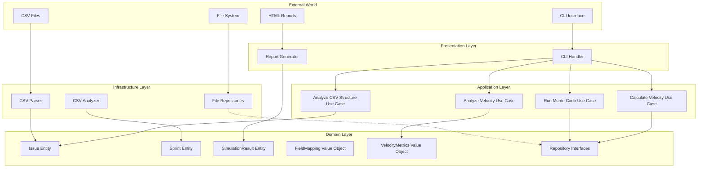
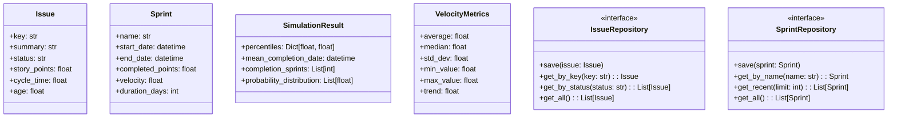
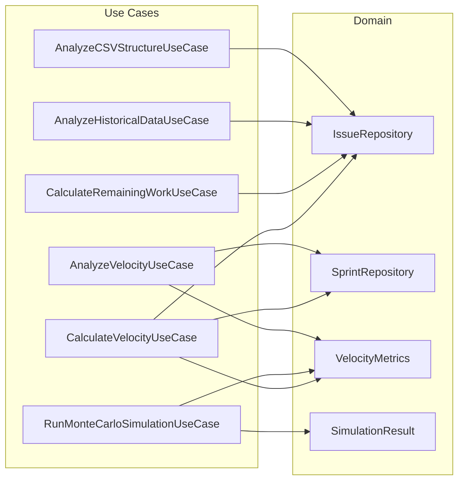
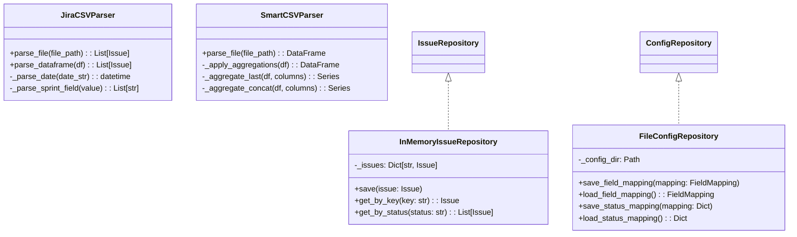
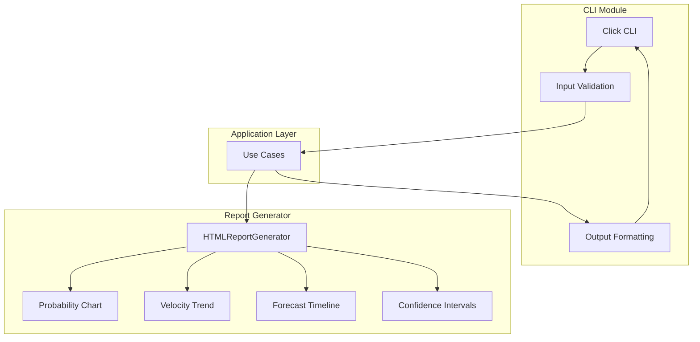
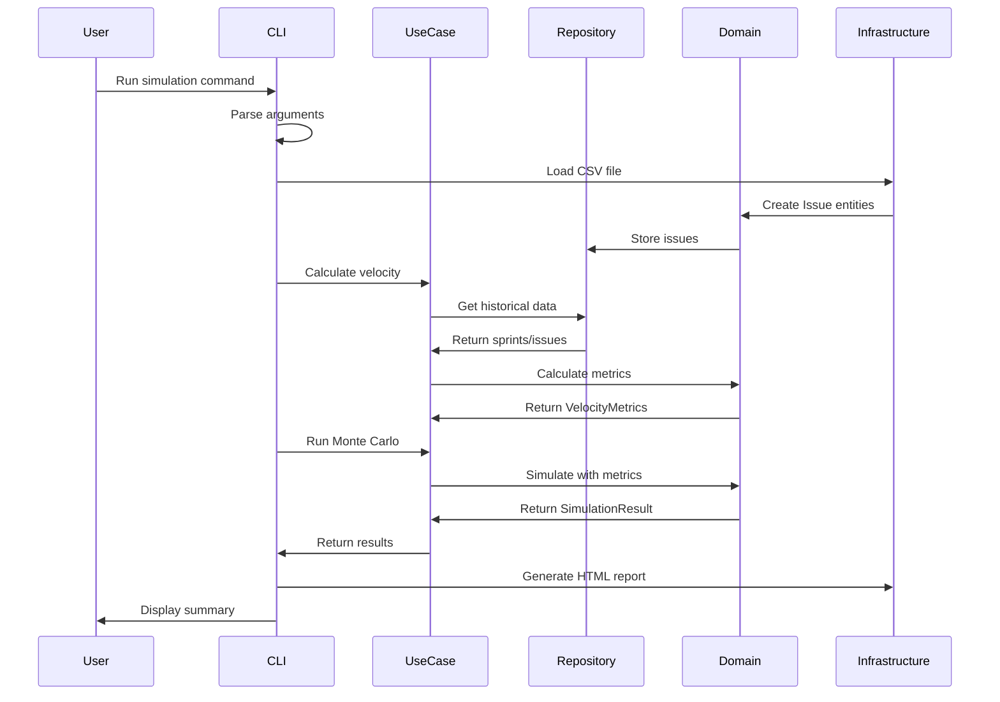
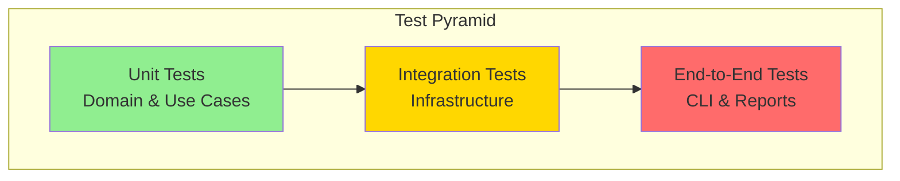

# Architecture Documentation

## Overview

This project follows **Clean Architecture** principles (also known as Hexagonal Architecture or Ports and Adapters) to create a maintainable, testable, and flexible system for Monte Carlo simulations of Jira project data.

## Clean Architecture Principles

The architecture is organized in concentric layers, with dependencies pointing inward:



### Key Principles

1. **Dependency Rule**: Dependencies only point inward. Inner layers know nothing about outer layers.
2. **Domain Independence**: Business logic doesn't depend on frameworks, databases, or UI.
3. **Testability**: Business rules can be tested without external dependencies.
4. **Flexibility**: External components (UI, database, frameworks) can be swapped without affecting business logic.

## Layer Breakdown

### 1. Domain Layer (Core Business Logic)

The innermost layer contains enterprise business rules and domain models.



**Key Components:**
- **Entities**: Core business objects with identity (Issue, Sprint, Team)
- **Value Objects**: Immutable objects without identity (VelocityMetrics, FieldMapping)
- **Repository Interfaces**: Abstractions for data access

### 2. Application Layer (Use Cases)

Contains application-specific business rules and orchestrates the flow of data.



**Use Case Examples:**

```python
class CalculateVelocityUseCase:
    """Calculates team velocity from historical sprint data"""
    def execute(self, lookback_sprints: int) -> VelocityMetrics:
        # Orchestrates domain objects to calculate velocity
        # No knowledge of CSV files, databases, or UI

class RunMonteCarloSimulationUseCase:
    """Runs Monte Carlo simulations based on velocity metrics"""
    def execute(self, remaining_work: float, 
                velocity_metrics: VelocityMetrics,
                config: SimulationConfig) -> SimulationResult:
        # Pure business logic for running simulations
```

### 3. Infrastructure Layer (External Interfaces)

Implements the interfaces defined in the domain layer and handles external concerns.



**Key Features:**
- **CSV Parsing**: Polars-based high-performance parsing with column aggregation
- **Repository Implementations**: In-memory storage with efficient lookups
- **Configuration Persistence**: JSON-based configuration storage

### 4. Presentation Layer (User Interface)

Handles user interaction and report generation.



**Responsibilities:**
- Command-line argument parsing and validation
- Interactive configuration
- Progress display with Rich library
- HTML report generation with Plotly charts

## Data Flow

Here's how data flows through the system during a typical simulation:



## Key Design Patterns

### 1. Repository Pattern
Abstracts data access behind interfaces, allowing different implementations without affecting business logic.

### 2. Use Case Pattern
Encapsulates application-specific business rules, keeping them separate from UI and infrastructure.

### 3. Value Object Pattern
Immutable objects that represent concepts without identity, ensuring data integrity.

### 4. Dependency Injection
Dependencies are injected rather than created, improving testability and flexibility.

## Testing Strategy

The Clean Architecture enables comprehensive testing at each layer:



### Unit Tests (Domain & Application)
- Test business logic in isolation
- No external dependencies
- Fast and deterministic
- Focus on behavior, not implementation

### Integration Tests (Infrastructure)
- Test CSV parsing with real file structures
- Test repository implementations
- Verify configuration persistence

### End-to-End Tests (Presentation)
- Test CLI commands
- Verify report generation
- Ensure proper error handling

## Benefits of This Architecture

1. **Testability**: Business logic can be tested without CSV files, databases, or UI
2. **Maintainability**: Clear separation of concerns makes changes easier
3. **Flexibility**: Can easily swap implementations (e.g., database instead of in-memory)
4. **Scalability**: Can add new features without affecting existing code
5. **Team Collaboration**: Clear boundaries enable parallel development

## Future Extensions

The architecture supports these potential enhancements without major refactoring:

- **Different Data Sources**: Add Jira API integration alongside CSV
- **Different Storage**: Replace in-memory with database persistence
- **Different UIs**: Add web interface alongside CLI
- **Different Analytics**: Add new simulation algorithms
- **Different Formats**: Support Excel, JSON, or API inputs