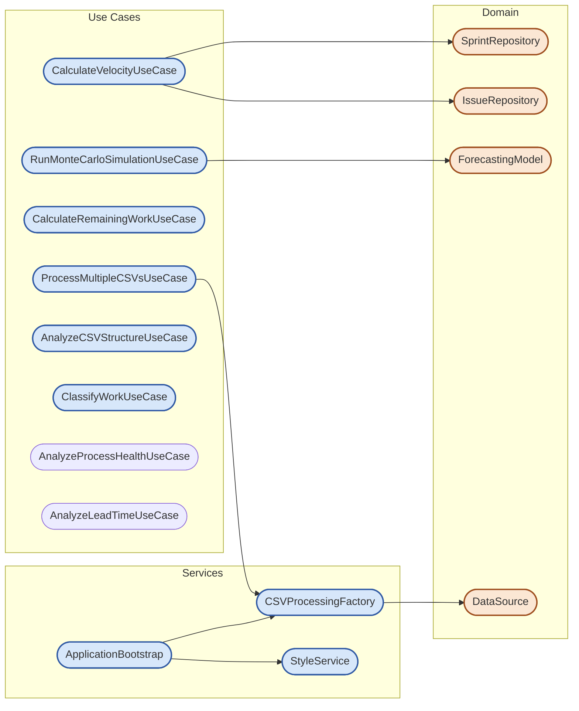
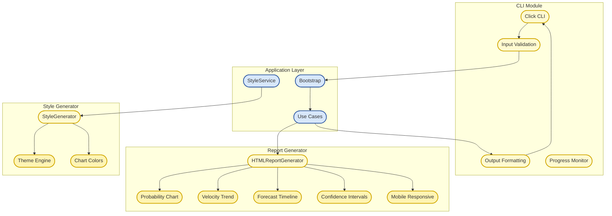
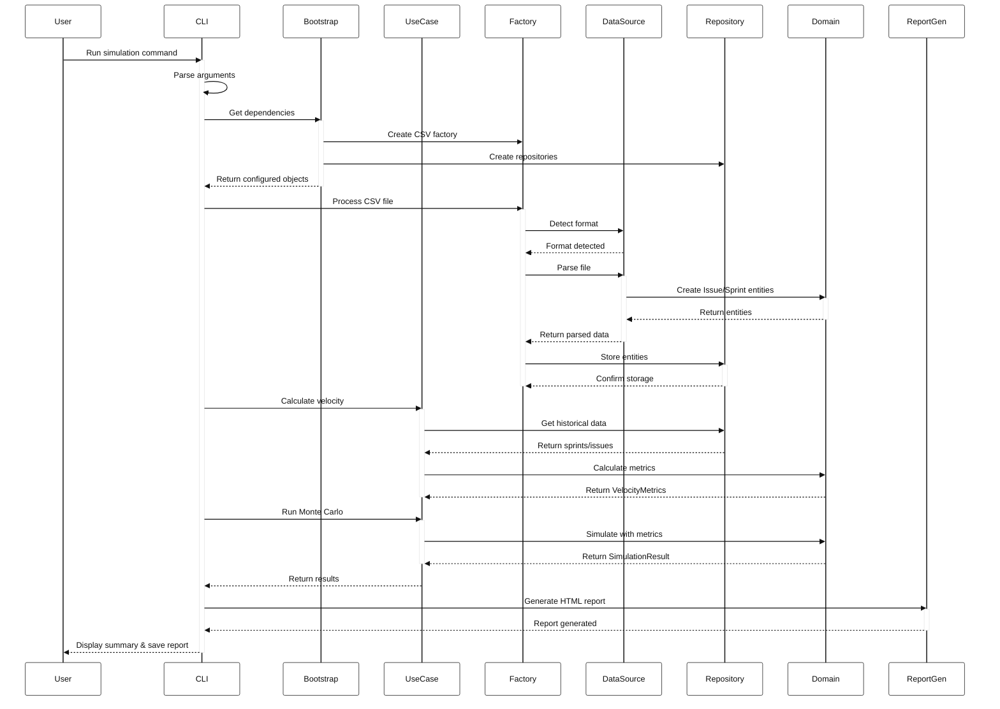
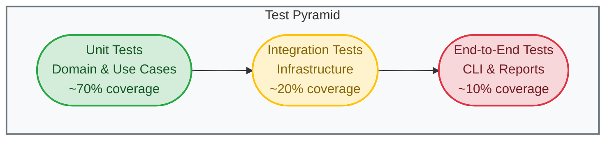

# Architecture Documentation

## Overview

This project follows **Clean Architecture** principles (also known as Hexagonal Architecture or Ports and Adapters) to create a maintainable, testable, and flexible system for Monte Carlo simulations of software project data. The architecture is designed to be a comprehensive software project analytics platform for teams and organizations of all sizes.

## Clean Architecture Principles

The architecture is organized in concentric layers, with dependencies pointing inward:

```mermaid
%%{init: { 'flowchart': { 'curve': 'basis', 'htmlLabels': false }}}%%
flowchart TB

%% EXTERNAL WORLD
subgraph "External World"
  CLI([CLI Interface])
  CSV[CSV Files]
  HTML[HTML Reports]
  FS[File System]
  API[REST/GraphQL APIs]
  GIT[Git Repositories]
end

%% PRESENTATION
subgraph "Presentation Layer"
  CLIHandler([CLI Handler])
  ReportGen([Report Generator])
  APIEndpoints([API Endpoints])
  MobileRenderer([Mobile Renderer])
end

%% APPLICATION
subgraph "Application Layer"
  UC1([Calculate Velocity Use Case])
  UC2([Run Monte Carlo Use Case])
  UC3([Analyze CSV Structure Use Case])
  UC4([Process Multiple CSVs Use Case])
  UC5([Work Classification Use Case])
  Bootstrap([Application Bootstrap])
  CSVFactory([CSV Processing Factory])
end

%% DOMAIN
subgraph "Domain Layer"
  E1([Issue Entity])
  E2([Sprint Entity])
  E3([SimulationResult Entity])
  E4([ProjectData Entity])
  VO1([FieldMapping Value Object])
  VO2([VelocityMetrics Value Object])
  R1([Repository Interfaces])
  DS1([DataSource Interface])
  FM1([ForecastingModel Interface])
end

%% INFRASTRUCTURE
subgraph "Infrastructure Layer"
  JiraDS([Jira Data Source])
  LinearDS([Linear Data Source])
  GitHubDS([GitHub Data Source])
  InMemRepo([In-Memory Repositories])
  FileRepo([File Repositories])
  DSFactory([Data Source Factory])
end

CLI --> CLIHandler
CLIHandler --> Bootstrap
Bootstrap --> UC1
Bootstrap --> UC2
Bootstrap --> UC3
Bootstrap --> UC4

UC1 --> R1
UC2 --> FM1
UC3 --> DS1
UC4 --> CSVFactory

CSVFactory --> DS1
JiraDS -.-> DS1
LinearDS -.-> DS1
GitHubDS -.-> DS1
InMemRepo -.-> R1

ReportGen --> E3
HTML --> ReportGen
CSV --> DSFactory
API --> APIEndpoints
GIT --> GitHubDS

%% LAYER COLOR STYLES
style CLI fill:#ecf2f8,stroke:#2456A3,stroke-width:2px,color:#111
style CSV fill:#ecf2f8,stroke:#2456A3,stroke-width:2px,color:#111
style HTML fill:#ecf2f8,stroke:#2456A3,stroke-width:2px,color:#111
style FS fill:#ecf2f8,stroke:#2456A3,stroke-width:2px,color:#111
style API fill:#ecf2f8,stroke:#2456A3,stroke-width:2px,color:#111
style GIT fill:#ecf2f8,stroke:#2456A3,stroke-width:2px,color:#111

style CLIHandler fill:#FFFAD0,stroke:#D1A800,stroke-width:2px,color:#111
style ReportGen fill:#FFFAD0,stroke:#D1A800,stroke-width:2px,color:#111
style APIEndpoints fill:#FFFAD0,stroke:#D1A800,stroke-width:2px,color:#111
style MobileRenderer fill:#FFFAD0,stroke:#D1A800,stroke-width:2px,color:#111

style UC1 fill:#D7E7FA,stroke:#335CA5,stroke-width:2px
style UC2 fill:#D7E7FA,stroke:#335CA5,stroke-width:2px
style UC3 fill:#D7E7FA,stroke:#335CA5,stroke-width:2px
style UC4 fill:#D7E7FA,stroke:#335CA5,stroke-width:2px
style UC5 fill:#D7E7FA,stroke:#335CA5,stroke-width:2px
style Bootstrap fill:#D7E7FA,stroke:#335CA5,stroke-width:2px
style CSVFactory fill:#D7E7FA,stroke:#335CA5,stroke-width:2px

style E1 fill:#FFF,stroke:#222,stroke-width:2px
style E2 fill:#FFF,stroke:#222,stroke-width:2px
style E3 fill:#FFF,stroke:#222,stroke-width:2px
style E4 fill:#FFF,stroke:#222,stroke-width:2px
style VO1 fill:#F7EFE3,stroke:#A1793B,stroke-width:2px
style VO2 fill:#F7EFE3,stroke:#A1793B,stroke-width:2px
style R1 fill:#FBE7D4,stroke:#A05121,stroke-width:2px
style DS1 fill:#FBE7D4,stroke:#A05121,stroke-width:2px
style FM1 fill:#FBE7D4,stroke:#A05121,stroke-width:2px

style JiraDS fill:#B9ECE4,stroke:#33846A,stroke-width:2px,color:#111
style LinearDS fill:#B9ECE4,stroke:#33846A,stroke-width:2px,color:#111
style GitHubDS fill:#B9ECE4,stroke:#33846A,stroke-width:2px,color:#111
style InMemRepo fill:#CAE6FB,stroke:#2456A3,stroke-width:2px
style FileRepo fill:#CAE6FB,stroke:#2456A3,stroke-width:2px
style DSFactory fill:#B9ECE4,stroke:#33846A,stroke-width:2px,color:#111
```



### Key Principles

1. **Dependency Rule**: Dependencies only point inward. Inner layers know nothing about outer layers.
2. **Domain Independence**: Business logic doesn't depend on frameworks, databases, or UI.
3. **Testability**: Business rules can be tested without external dependencies.
4. **Flexibility**: External components (UI, database, frameworks) can be swapped without affecting business logic.
5. **Plugin Architecture**: New features can be added without modifying existing code.

## Layer Breakdown

### 1. Domain Layer (Core Business Logic)

The innermost layer contains enterprise business rules and domain models.

```mermaid
%%{init: { 'theme': 'base', 'themeVariables': { 'primaryColor': '#fff', 'primaryTextColor': '#111', 'primaryBorderColor': '#222', 'lineColor': '#333', 'secondaryColor': '#f7efe3', 'tertiaryColor': '#fbe7d4', 'background': '#fff' }}}%%
classDiagram
    class Issue {
        +key: str
        +summary: str
        +status: IssueStatus
        +story_points: float
        +cycle_time: float
        +age: float
        +work_type: WorkType
    }
    
    class Sprint {
        +name: str
        +start_date: datetime
        +end_date: datetime
        +completed_points: float
        +velocity: float
        +duration_days: int
    }
    
    class SimulationResult {
        +percentiles: Dict[float, float]
        +mean_completion_date: datetime
        +completion_sprints: List[int]
        +probability_distribution: List[float]
    }
    
    class VelocityMetrics {
        +average: float
        +median: float
        +std_dev: float
        +min_value: float
        +max_value: float
        +trend: float
    }
    
    class DataSource {
        <<interface>>
        +parse_file(file_path): Tuple[List[Issue], List[Sprint]]
        +detect_format(file_path): bool
        +get_info(): DataSourceInfo
        +analyze_structure(file_path): Dict
    }
    
    class IssueRepository {
        <<interface>>
        +save(issue: Issue)
        +get_by_key(key: str): Issue
        +get_by_status(status: str): List[Issue]
        +get_all(): List[Issue]
    }
    
    class ForecastingModel {
        <<interface>>
        +forecast(data: ForecastData): SimulationResult
        +get_confidence_intervals(): Dict[float, float]
    }

    style Issue fill:#FFF,stroke:#222,stroke-width:2px
    style Sprint fill:#FFF,stroke:#222,stroke-width:2px
    style SimulationResult fill:#FFF,stroke:#222,stroke-width:2px
    style VelocityMetrics fill:#F7EFE3,stroke:#A1793B,stroke-width:2px
    style DataSource fill:#FBE7D4,stroke:#A05121,stroke-width:2px
    style IssueRepository fill:#FBE7D4,stroke:#A05121,stroke-width:2px
    style ForecastingModel fill:#FBE7D4,stroke:#A05121,stroke-width:2px
```



**Key Components:**
- **Entities**: Core business objects with identity (Issue, Sprint, Team, ProjectData)
- **Value Objects**: Immutable objects without identity (VelocityMetrics, FieldMapping, WorkType)
- **Repository Interfaces**: Abstractions for data access
- **Domain Services**: Business logic that doesn't fit in entities (DataSource, ForecastingModel)

**Key Files:**
- `src/domain/entities.py` - Core business objects
- `src/domain/value_objects.py` - Immutable value objects  
- `src/domain/data_sources.py` - Data source abstraction
- `src/domain/repositories.py` - Repository interfaces
- `src/domain/forecasting.py` - Forecasting model interfaces
- `src/domain/process_health.py` - Process health analysis domain models

#### Process Health Domain Models

The process health analysis system provides comprehensive metrics for team performance:

```python
# Key domain models for process health
- LeadTimeMetrics: Tracks cycle time, lead time, wait time, and flow efficiency
- LeadTimeAnalysis: Aggregates lead time metrics with percentiles and defect rates
- AgingAnalysis: Categorizes work items by age (Fresh, Normal, Aging, Stale, Abandoned)
- WIPAnalysis: Monitors work in progress with configurable limits
- SprintHealthAnalysis: Tracks sprint completion rates and scope changes
- BlockedItemsAnalysis: Analyzes impediments by severity
- ProcessHealthMetrics: Calculates overall health score (0-100%) with component breakdown
- HealthScoreComponent: Individual health metric with score, weight, and expandable detail items
```

The health scoring system uses bounded calculations (0-100%) with intelligent heuristics:
- Lead time scoring based on industry benchmarks (<7 days excellent, <14 days good)
- Flow efficiency bonus for teams with >70% active work time
- WIP limits adjusted based on team size
- Defect rate penalties for quality issues

### 2. Application Layer (Use Cases)

Contains application-specific business rules and orchestrates the flow of data.



**Key Components:**
- **Use Cases**: Orchestrate business operations without knowledge of UI or infrastructure
- **Application Services**: Support services like StyleService for theme management
- **Factories**: Create domain objects with proper dependency injection
- **Bootstrap**: Central dependency injection configuration

**Key Files:**
- `src/application/use_cases.py` - Core business operations
- `src/application/process_health_use_cases.py` - Process health analysis operations
- `src/application/csv_processing_factory.py` - Factory for CSV processors
- `src/application/bootstrap.py` - Dependency injection setup
- `src/application/csv_adapters.py` - Adapters to bridge infrastructure with domain

### 3. Infrastructure Layer (External Interfaces)

Implements the interfaces defined in the domain layer and handles external concerns.

```mermaid
%%{init: { 'theme': 'base', 'themeVariables': { 'primaryColor': '#B9ECE4', 'primaryTextColor': '#111', 'primaryBorderColor': '#33846A', 'lineColor': '#333' }}}%%
classDiagram
    class JiraCSVDataSource {
        +parse_file(file_path): Tuple[List[Issue], List[Sprint]]
        +detect_format(file_path): bool
        +get_info(): DataSourceInfo
        -_parse_date(date_str): datetime
        -_extract_sprints(df): List[Sprint]
    }
    
    class LinearCSVDataSource {
        +parse_file(file_path): Tuple[List[Issue], List[Sprint]]
        +detect_format(file_path): bool
        +get_info(): DataSourceInfo
        -_map_tshirt_sizes(size): float
        -_convert_cycles_to_sprints(cycles): List[Sprint]
    }
    
    class JiraRESTDataSource {
        +base_url: str
        +auth_token: str
        +parse(project_key): Tuple[List[Issue], List[Sprint]]
        -_fetch_all_issues(project_key): List[Issue]
        -_fetch_all_sprints(project_key): List[Sprint]
    }
    
    class InMemoryIssueRepository {
        -_issues: Dict[str, Issue]
        +save(issue: Issue)
        +get_by_key(key: str): Issue
        +get_by_status(status: str): List[Issue]
    }
    
    class FileConfigRepository {
        -_config_dir: Path
        +save_field_mapping(mapping: FieldMapping)
        +load_field_mapping(): FieldMapping
        +save_theme(theme: Theme)
        +load_theme(name: str): Theme
    }
    
    class DefaultDataSourceFactory {
        -sources: Dict[DataSourceType, Type[DataSource]]
        +create(source_type): DataSource
        +detect_source_type(file_path): DataSourceType
        +register(source_type, implementation)
    }
    
    DataSource <|.. JiraCSVDataSource
    DataSource <|.. LinearCSVDataSource
    DataSource <|.. JiraRESTDataSource
    IssueRepository <|.. InMemoryIssueRepository
    ConfigRepository <|.. FileConfigRepository
    DataSourceFactory <|.. DefaultDataSourceFactory

    style JiraCSVDataSource fill:#B9ECE4,stroke:#33846A,stroke-width:2px
    style LinearCSVDataSource fill:#B9ECE4,stroke:#33846A,stroke-width:2px
    style JiraRESTDataSource fill:#B9ECE4,stroke:#33846A,stroke-width:2px
    style InMemoryIssueRepository fill:#CAE6FB,stroke:#2456A3,stroke-width:2px
    style FileConfigRepository fill:#CAE6FB,stroke:#2456A3,stroke-width:2px
    style DefaultDataSourceFactory fill:#B9ECE4,stroke:#33846A,stroke-width:2px
```



**Key Features:**
- **Data Sources**: Multiple implementations for different formats (CSV, REST API, etc.)
- **Repository Implementations**: In-memory storage with efficient lookups
- **Configuration Persistence**: JSON-based configuration storage
- **Smart Parsing**: Column aggregation, date parsing, status mapping

**Key Files:**
- `src/infrastructure/jira_data_source.py` - Jira CSV implementation
- `src/infrastructure/linear_data_source.py` - Linear CSV implementation
- `src/infrastructure/jira_api_data_source.py` - Jira REST API implementation
- `src/infrastructure/cache.py` - API response caching system
- `src/infrastructure/repositories.py` - Repository implementations
- `src/infrastructure/data_source_factory.py` - Factory for data sources

### 4. Presentation Layer (User Interface)

Handles user interaction and report generation.



**Responsibilities:**
- Command-line argument parsing and validation
- Interactive configuration
- Progress display with Rich library
- HTML report generation with Plotly charts
- Theme management and styling
- Mobile-responsive output

**Key Files:**
- `src/presentation/cli.py` - Command-line interface
- `src/presentation/report_generator.py` - HTML report generation
- `src/presentation/style_generator.py` - CSS generation from themes
- `src/presentation/multi_project_report_generator.py` - Multi-project reports

## Data Flow

Here's how data flows through the system during a typical simulation:



## Key Design Patterns

### 1. Repository Pattern
Abstracts data access behind interfaces, allowing different implementations without affecting business logic.

```python
# Domain layer defines interface
class IssueRepository(ABC):
    @abstractmethod
    def save(self, issue: Issue) -> None: pass
    
    @abstractmethod
    def get_by_key(self, key: str) -> Optional[Issue]: pass

# Infrastructure provides implementation
class InMemoryIssueRepository(IssueRepository):
    def __init__(self):
        self._issues: Dict[str, Issue] = {}
    
    def save(self, issue: Issue) -> None:
        self._issues[issue.key] = issue
```

### 2. Factory Pattern
Creates objects without specifying exact classes, enabling extensibility.

```python
class CSVProcessingFactory:
    def register_parser(self, name: str, parser_class: Type[CSVParser]):
        self._parsers[name] = parser_class
    
    def create_parser(self, name: str, **kwargs) -> CSVParser:
        return self._parsers[name](**kwargs)
```

### 3. Adapter Pattern
Bridges incompatible interfaces between layers.

```python
class EnhancedSprintExtractorAdapter(SprintExtractor):
    """Adapts infrastructure SprintExtractor to domain interface"""
    def __init__(self, extractor: EnhancedSprintExtractor):
        self._extractor = extractor
    
    def extract_from_issues(self, issues: List[Issue]) -> List[Sprint]:
        return self._extractor.extract_from_issues(issues)
```

### 4. Strategy Pattern
Allows switching algorithms at runtime.

```python
class ForecastingModel(ABC):
    @abstractmethod
    def forecast(self, data: ForecastData) -> SimulationResult: pass

class MonteCarloModel(ForecastingModel):
    def forecast(self, data: ForecastData) -> SimulationResult:
        # Monte Carlo implementation

class ProbabilisticModel(ForecastingModel):
    def forecast(self, data: ForecastData) -> SimulationResult:
        # Alternative implementation
```

### 5. Dependency Injection
Dependencies are injected rather than created, improving testability and flexibility.

```python
class ApplicationBootstrap:
    def get_csv_processing_factory(self) -> CSVProcessingFactory:
        factory = CSVProcessingFactory()
        # Wire up all dependencies
        factory.register_parser("jira", JiraCSVParser)
        factory.register_analyzer("smart", SmartCSVParser)
        return factory
```

## Testing Strategy

The Clean Architecture enables comprehensive testing at each layer:



### Unit Tests (Domain & Application)
- Test business logic in isolation
- No external dependencies
- Fast and deterministic
- Focus on behavior, not implementation

### Integration Tests (Infrastructure)
- Test CSV parsing with real file structures
- Test repository implementations
- Verify configuration persistence
- Test data source detection

### End-to-End Tests (Presentation)
- Test CLI commands
- Verify report generation
- Ensure proper error handling
- Test multi-project processing

## Multi-Project Support

The architecture seamlessly supports processing multiple CSV files to generate combined analysis:

### Domain Layer Extensions

```python
@dataclass
class ProjectData:
    """Data from a single CSV file/project"""
    name: str
    source_path: Path
    issues: List[Issue]
    sprints: List[Sprint]
    velocity_metrics: VelocityMetrics
    simulation_result: SimulationResult
    remaining_work: float

@dataclass
class AggregatedMetrics:
    """Aggregated metrics across multiple projects"""
    total_projects: int
    total_issues: int
    total_remaining_work: float
    combined_velocity: float
    confidence_intervals: Dict[float, int]
```

### Application Layer Extensions

The `ProcessMultipleCSVsUseCase` orchestrates:
1. Independent processing of each CSV file
2. Separate repository instances per project
3. Aggregation of metrics across projects
4. Generation of both individual and combined reports

### Presentation Layer Extensions

The `MultiProjectReportGenerator` creates:
- Dashboard with aggregated metrics and comparisons
- Interactive charts for cross-project analysis
- Navigation links to individual project reports
- Workload distribution visualization

## Styling Architecture

The styling system follows the same clean architecture principles:

### Domain Layer
- **Theme Entity**: Complete theme configuration including colors, typography, spacing
- **Color Value Object**: RGB/hex color representation with conversion methods
- **Typography Value Object**: Font family, size, weight, and spacing
- **ChartColors Value Object**: Specialized color scheme for data visualization
  - Semantic colors for confidence levels (green/amber/red)
  - Colorblind-friendly data series palette
  - Gradient colors for distributions

### Application Layer
- **StyleService**: Manages theme selection and style generation
- Provides theme management without knowledge of CSS or HTML
- Default theme selection (Opreto)

### Infrastructure Layer
- **FileThemeRepository**: JSON-based theme storage
- Available themes:
  - "opreto" (default): Teal/professional with BI-standard chart colors
  - "generic": Purple/modern with traditional chart colors

### Presentation Layer
- **StyleGenerator**: Converts theme objects to CSS
- Chart color coordination following BI best practices:
  - Green (#00A86B) for high confidence/positive outcomes
  - Orange (#FFA500) for medium confidence/caution
  - Red (#DC143C) for low confidence/risk

## Data Source Abstraction

The system implements a flexible data source abstraction that supports multiple input formats:

### Domain Layer
- **DataSource Interface**: Abstract interface for all data sources
  - `parse_file()`: Extract issues and sprints from a file
  - `detect_format()`: Auto-detect if a file matches this format
  - `get_info()`: Return metadata about the data source
  - `analyze_structure()`: Analyze file structure and contents

### Current Data Sources
1. **Jira CSV** - Handles Jira CSV exports with smart field detection
2. **Linear CSV** - Processes Linear exports with cycle-to-sprint conversion
3. **Jira REST API** - Direct integration with Jira Cloud/Server
   - Automatic pagination to fetch all issues
   - Intelligent caching with 1-hour TTL
   - Fallback to direct REST API when SDK fails
4. **Jira XML** - Parses Jira XML exports (experimental)

### Adding New Data Sources

See [ADDING_DATA_SOURCES.md](./ADDING_DATA_SOURCES.md) for detailed instructions.

### Caching System

The architecture includes an intelligent caching system for API responses:

- **File-based Cache**: Stores pickled responses in `~/.jira-monte-carlo/cache/`
- **TTL Support**: Configurable time-to-live (default 1 hour)
- **Automatic Expiration**: Expired entries are automatically cleaned up
- **Cache Management**: CLI commands for viewing and clearing cache
- **Key Features**:
  - Reduces API load during report iteration
  - Speeds up subsequent runs dramatically
  - Handles complex data types (issues, sprints, etc.)
  - Thread-safe file operations

## Extension Points

The architecture provides clear extension points for new features:

### Adding New Data Sources
1. Implement `DataSource` interface
2. Register with `DataSourceFactory`
3. Add field mapping configuration

### Adding New Forecasting Models
1. Implement `ForecastingModel` interface
2. Register with `ModelFactory`
3. Define model configuration

### Adding Custom Report Capability Checkers (Plugin System)

The system now supports plugin-driven capability detection through dependency injection:

1. **Create a Custom Capability Checker**:
   ```python
   from application.capability_analyzer import ReportCapabilityChecker
   
   class MyCustomChecker(ReportCapabilityChecker):
       def check_availability(self, issues, sprints, available_fields):
           # Custom logic to determine if report is available
           # Can delegate to domain-specific components
           pass
   ```

2. **Register with Plugin Registry**:
   ```python
   from application.plugin_registry import report_plugin_registry
   
   report_plugin_registry.register(
       ReportType.MY_REPORT,
       MyCustomChecker
   )
   ```

3. **Benefits**:
   - Each report type can have specialized availability logic
   - Plugins can override default capability checking
   - Enables future extensibility without modifying core code
   - Supports dependency injection for testing
   - Components responsible for each report type determine their own availability
   - Prepares the system for dynamic plugin loading

4. **Example Implementation**:
   See `src/plugins/example_plugin.py` for a complete example of a custom sprint health checker.

### Other Extension Points
- **Report Formats**: Implement `ReportGenerator` interface
- **Chart Renderers**: Implement `ChartRenderer` interface
- **Storage Backends**: Implement repository interfaces
- **Work Classifiers**: Implement `WorkClassifier` interface
- **Repository Analyzers**: Implement `RepositoryAnalyzer` interface

## Future Architecture Considerations

### Mobile-Friendly Output
- Responsive chart generation abstraction
- Server-side rendering for complex visualizations
- Separate mobile vs desktop template strategies

### Git Repository Integration
- Repository analysis domain model
- Commit pattern analysis
- Code ownership metrics
- Integration with work classification

### Plugin Architecture
- Dynamic loading of extensions
- Plugin registry and discovery
- Sandboxed execution environment
- Plugin configuration management

### Work Classification System
- AI/ML-based classification
- Custom rule engines
- Integration with Opreto methodology
- Training data management

## Benefits of This Architecture

1. **Testability**: Business logic can be tested without CSV files, databases, or UI
2. **Maintainability**: Clear separation of concerns makes changes easier
3. **Flexibility**: Can easily swap implementations (e.g., database instead of in-memory)
4. **Scalability**: Can add new features without affecting existing code
5. **Team Collaboration**: Clear boundaries enable parallel development
6. **SaaS Ready**: Architecture supports multi-tenancy and cloud deployment

## SaaS Readiness

The architecture is designed to support multi-tenancy and cloud deployment:

1. **Stateless Operations**: All use cases are stateless
2. **Repository Abstraction**: Easy to swap from in-memory to database
3. **Authentication Hooks**: Can add auth at application layer
4. **Multi-tenant Support**: Can add tenant context to repositories
5. **API-First Design**: Use cases can be exposed as REST/GraphQL endpoints
6. **Event-Driven Ready**: Can add domain events for real-time updates

See [SAAS_READINESS.md](./SAAS_READINESS.md) for detailed analysis.

## Getting Started

To work with the architecture:

1. **Understand the layers**: Start with domain entities and work outward
2. **Follow the dependency rule**: Never import from outer layers
3. **Use the bootstrap**: Always get dependencies from ApplicationBootstrap
4. **Write tests first**: Test domain logic before infrastructure
5. **Extend via interfaces**: Add new features by implementing interfaces

For specific tasks:
- Adding data sources: See [ADDING_DATA_SOURCES.md](./ADDING_DATA_SOURCES.md)
- SaaS transformation: See [SAAS_READINESS.md](./SAAS_READINESS.md)
- Architecture decisions: See LADRs in `docs/architecture/`