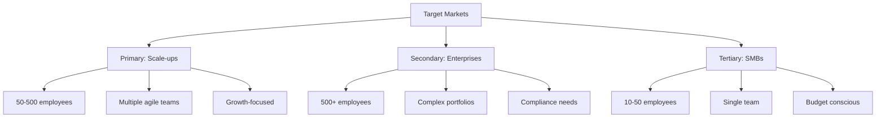
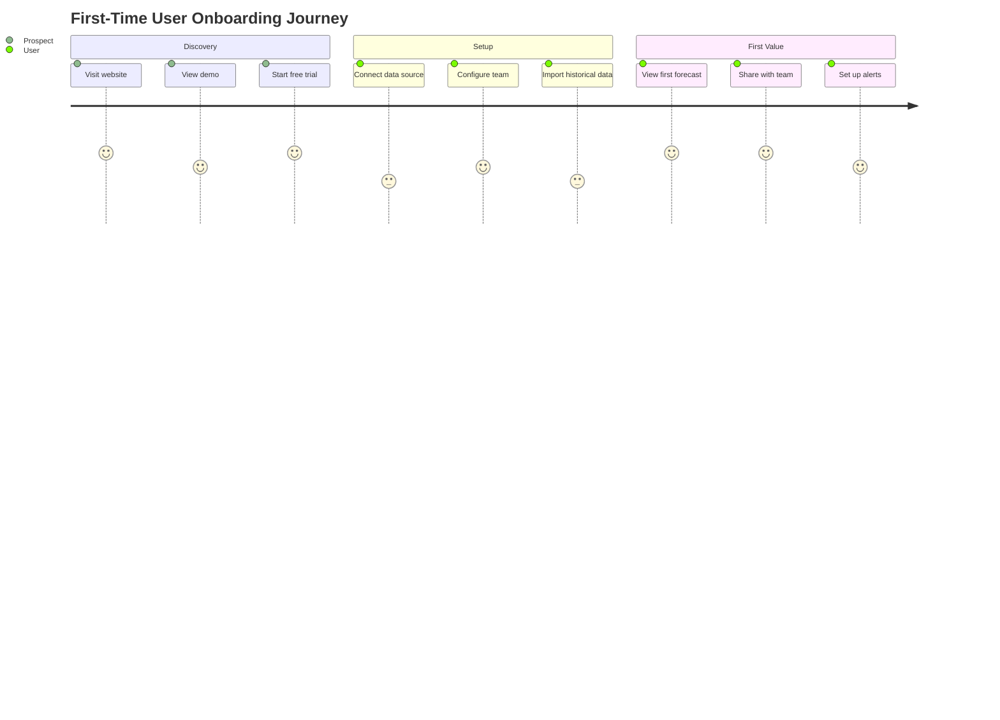
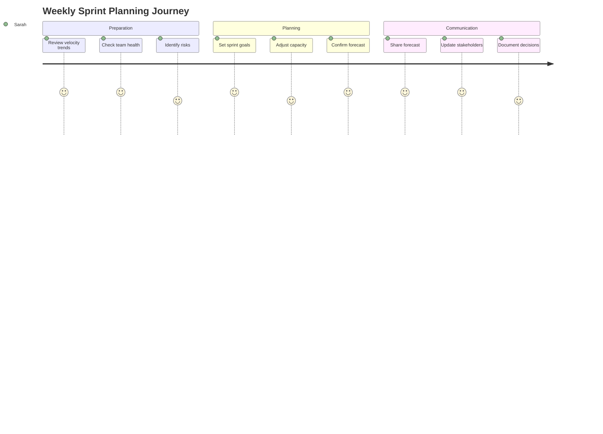
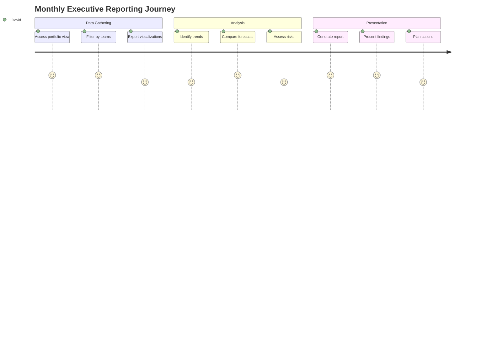
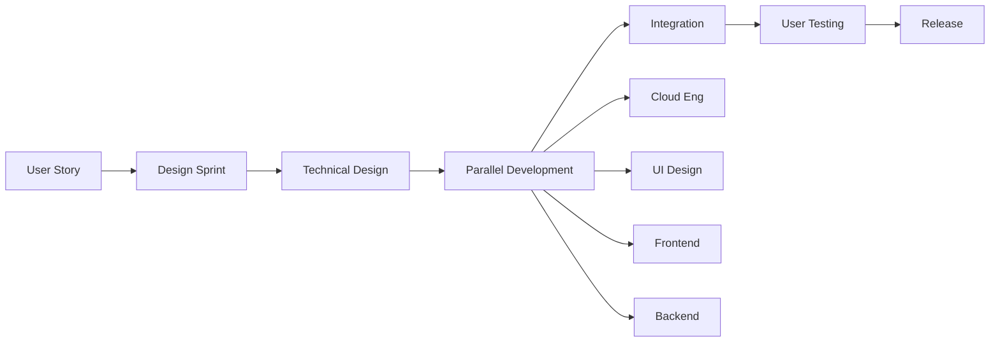
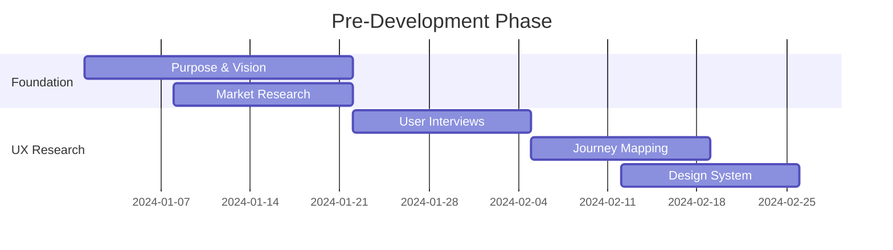
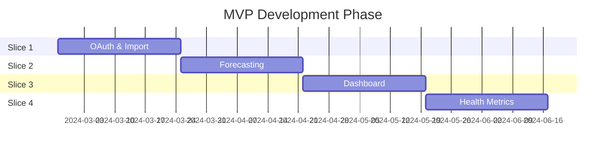
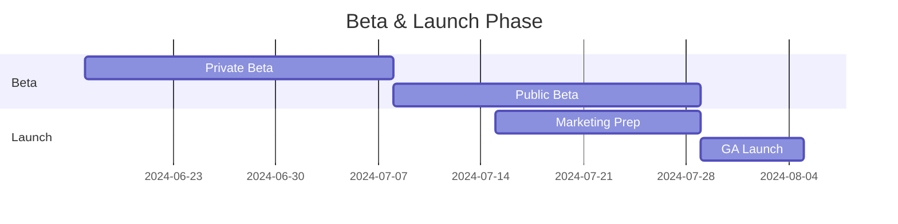
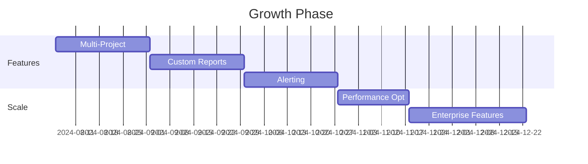

# SaaS Project Roadmap: Monte Carlo Analytics Platform

A comprehensive roadmap for transforming the Monte Carlo forecasting tool into a world-class SaaS product using vertical slice development methodology.

## Table of Contents

1. [Phase 1: Purpose & Vision Definition](#phase-1-purpose--vision-definition)
2. [Phase 2: UX Research & Journey Mapping](#phase-2-ux-research--journey-mapping)
3. [Phase 3: Vertical Slice Development](#phase-3-vertical-slice-development)
4. [Development Methodology](#development-methodology)
5. [Detailed Roadmap Timeline](#detailed-roadmap-timeline)
6. [Team Structure & Resources](#team-structure--resources)
7. [Success Metrics & KPIs](#success-metrics--kpis)
8. [Risk Management](#risk-management)

## Phase 1: Purpose & Vision Definition (Weeks 1-3)

### 1.1 Product Vision Statement

**Mission**: Empower agile teams to make data-driven decisions with confidence through intelligent forecasting and health analytics.

**Vision**: Become the trusted analytics platform for agile teams worldwide, turning historical data into actionable insights that drive successful project outcomes.

### 1.2 Core Value Propositions

#### For Agile Teams
- **Predictable Delivery**: Know when projects will complete with statistical confidence
- **Early Warning System**: Identify process health issues before they impact delivery
- **Data-Driven Decisions**: Replace guesswork with evidence-based planning

#### For Leadership
- **Portfolio Visibility**: Understand delivery across multiple teams and projects
- **Risk Mitigation**: Identify and address delivery risks proactively
- **Resource Optimization**: Make informed staffing and capacity decisions

#### For Organizations
- **Improved Predictability**: Increase on-time delivery from industry average 40% to 85%+
- **Reduced Waste**: Identify and eliminate process inefficiencies
- **Continuous Improvement**: Track and measure the impact of process changes

### 1.3 Target Market Segments

### 1.4 Competitive Positioning

| Competitor | Strengths | Our Differentiation |
|------------|-----------|---------------------|
| Jira Advanced Roadmaps | Integrated with Jira | Statistical forecasting, not just planning |
| Azure DevOps Analytics | Microsoft ecosystem | Platform-agnostic, better visualizations |
| Plandek | Comprehensive metrics | Focused UX, actionable insights |
| LinearB | Developer metrics | Broader agile metrics, Monte Carlo simulation |

### 1.5 Success Criteria

- **Year 1**: 100 paying customers, $1M ARR
- **Year 2**: 500 customers, $5M ARR, Series A funding
- **Year 3**: 2000 customers, $20M ARR, market leader in agile analytics

## Phase 2: UX Research & Journey Mapping (Weeks 4-8)

### 2.1 User Personas

#### Primary Persona: "Sarah the Scrum Master"
- **Goals**: Improve team velocity, identify blockers, accurate sprint planning
- **Pain Points**: Manual data gathering, lack of historical insights, surprise delays
- **Success Metrics**: Sprint predictability, team happiness, on-time delivery

#### Secondary Persona: "David the Delivery Manager"
- **Goals**: Portfolio visibility, resource allocation, stakeholder communication
- **Pain Points**: Disparate data sources, manual reporting, unclear dependencies
- **Success Metrics**: Portfolio health, delivery predictability, resource utilization

#### Tertiary Persona: "Elena the Engineering Manager"
- **Goals**: Team performance, process improvement, capacity planning
- **Pain Points**: Lack of actionable metrics, reactive management, unclear bottlenecks
- **Success Metrics**: Team efficiency, quality metrics, delivery speed

### 2.2 Core User Journeys

#### Journey 1: First-Time Setup & Onboarding

#### Journey 2: Weekly Planning Ritual

#### Journey 3: Executive Reporting

### 2.3 Key Interaction Points

1. **Data Connection**: OAuth flow for Jira/Linear
2. **Dashboard**: Primary workspace for daily use
3. **Forecast Builder**: Interactive Monte Carlo configuration
4. **Health Monitor**: Real-time process health alerts
5. **Report Generator**: Customizable reports and exports

## Phase 3: Vertical Slice Development

### 3.1 Vertical Slice Definition

Each vertical slice includes:
- **Cloud Engineering**: Infrastructure, security, data pipeline
- **Design**: UI/UX patterns, design system components
- **UI Engineering**: Frontend implementation, responsive design
- **System Engineering**: Backend APIs, integrations, business logic

### 3.2 Slice Prioritization Matrix

| Slice | User Value | Technical Risk | Market Diff | Priority |
|-------|-----------|---------------|-------------|----------|
| OAuth & Data Import | High | Medium | Low | 1 |
| Basic Forecasting | Critical | Low | High | 2 |
| Interactive Dashboard | High | Low | Medium | 3 |
| Team Health Metrics | Medium | Low | High | 4 |
| Multi-Project Views | High | Medium | Medium | 5 |
| Custom Reporting | Medium | Low | Low | 6 |
| Alerting System | Medium | Medium | Medium | 7 |
| Admin & Billing | Required | High | Low | 8 |

### 3.3 Detailed Vertical Slices

#### Slice 1: OAuth & Data Import (Weeks 9-12)

**User Story**: As Sarah, I want to connect my Jira instance without sharing passwords so that my data stays secure.

**Cloud Engineering**:
- AWS Cognito setup for user authentication
- Secrets Manager for OAuth tokens
- SQS for async data import jobs
- RDS for storing imported data

**Design**:
- Connection flow mockups
- Loading states and progress indicators
- Error handling patterns
- Success confirmation screens

**UI Engineering**:
- OAuth flow implementation
- Project selection interface
- Import progress tracking
- Error recovery flows

**System Engineering**:
- OAuth service implementation
- Jira/Linear API adapters
- Data transformation pipeline
- Background job processing

**Acceptance Criteria**:
- User can authenticate with Jira/Linear via OAuth
- User can select projects to import
- Historical data imports successfully
- Progress is clearly communicated
- Errors are gracefully handled

#### Slice 2: Basic Forecasting (Weeks 13-16)

**User Story**: As Sarah, I want to see when my project will complete based on historical velocity so that I can set realistic expectations.

**Cloud Engineering**:
- Lambda functions for Monte Carlo calculations
- ElastiCache for caching results
- CloudWatch for performance monitoring

**Design**:
- Forecast visualization design
- Confidence level selector
- Interactive chart components
- Mobile-responsive layouts

**UI Engineering**:
- Chart.js/D3 implementation
- Real-time parameter adjustment
- Responsive design
- Export functionality

**System Engineering**:
- Monte Carlo engine optimization
- REST API for forecasts
- Caching strategy
- WebSocket for live updates

**Acceptance Criteria**:
- User can generate forecasts with different confidence levels
- Visualizations clearly show probability distributions
- Results update in real-time as parameters change
- Performance is sub-second for typical datasets

#### Slice 3: Interactive Dashboard (Weeks 17-20)

**User Story**: As David, I want a customizable dashboard showing all my teams' key metrics so that I can quickly assess portfolio health.

**Cloud Engineering**:
- CloudFront CDN configuration
- S3 for static assets
- API Gateway rate limiting

**Design**:
- Dashboard layout system
- Widget library design
- Drag-and-drop interactions
- Dark mode support

**UI Engineering**:
- React component library
- Grid layout system
- Widget framework
- State management

**System Engineering**:
- GraphQL API implementation
- Real-time subscriptions
- Efficient data aggregation
- Permission system

**Acceptance Criteria**:
- User can customize dashboard layout
- Widgets update in real-time
- Dashboard loads in under 2 seconds
- Mobile experience is optimized

## Development Methodology

### 4.1 Vertical Slice Process

### 4.2 Sprint Structure (2-week sprints)

**Week 1**:
- Day 1-2: Design sprint & technical planning
- Day 3-5: Parallel development begins
- Day 6-7: Mid-sprint sync & adjustments
- Day 8-10: Development continues

**Week 2**:
- Day 1-2: Integration begins
- Day 3-4: Internal testing & fixes
- Day 5: User testing session
- Day 6-7: Refinements & deployment
- Day 8: Sprint review & retrospective

### 4.3 Quality Gates

Each slice must pass:
1. **Design Review**: Consistency with design system
2. **Security Review**: OWASP compliance check
3. **Performance Test**: Meet defined SLAs
4. **Accessibility Audit**: WCAG 2.1 AA compliance
5. **User Acceptance**: 80%+ task completion rate

## Detailed Roadmap Timeline

### Pre-Development Phase (Weeks 1-8)

### MVP Development (Weeks 9-24)

### Beta & Launch (Weeks 25-32)

### Post-Launch Growth (Weeks 33-52)

## Team Structure & Resources

### 6.1 Core Team Composition

#### Leadership
- **Product Manager**: Drive vision, prioritize slices, user research
- **Technical Lead**: Architecture decisions, technical mentorship
- **Design Lead**: Design system, UX consistency, user testing

#### Development Team
- **Cloud Engineers** (2): Infrastructure, security, DevOps
- **UI/UX Designers** (2): User research, visual design, prototypes
- **Frontend Engineers** (3): React development, component library
- **Backend Engineers** (3): APIs, integrations, data processing
- **QA Engineer** (1): Test automation, quality assurance

#### Support Functions
- **Customer Success** (1): Beta management, user feedback
- **DevOps Engineer** (1): CI/CD, monitoring, deployment
- **Data Analyst** (1): Product analytics, user behavior

### 6.2 Team Scaling Plan

**Phase 1 (MVP)**: 12 people
**Phase 2 (Growth)**: +8 people (20 total)
**Phase 3 (Scale)**: +15 people (35 total)

### 6.3 External Resources

- **Security Consultant**: Quarterly audits
- **Performance Consultant**: Optimization sprints
- **UX Research Agency**: Major feature validation
- **Legal Counsel**: Terms of service, privacy policy

## Success Metrics & KPIs

### 7.1 Product Metrics

#### Acquisition
- **Trial Starts**: 1000/month by month 6
- **Trial-to-Paid**: 15% conversion rate
- **Organic Traffic**: 50% of acquisitions

#### Activation
- **Time to First Value**: <10 minutes
- **Onboarding Completion**: 80%
- **First Week Retention**: 70%

#### Engagement
- **Daily Active Users**: 60% of total
- **Features Adopted**: 4+ per account
- **Mobile Usage**: 30% of sessions

#### Revenue
- **MRR Growth**: 20% month-over-month
- **ARPU**: $200/month
- **Churn Rate**: <5% monthly

### 7.2 Technical Metrics

#### Performance
- **Page Load Time**: <2 seconds (P95)
- **API Response Time**: <200ms (P95)
- **Uptime**: 99.9% availability
- **Error Rate**: <0.1%

#### Scale
- **Concurrent Users**: 10,000+
- **Data Processing**: 1M issues/hour
- **Storage Efficiency**: <$0.10/GB/month

### 7.3 Team Metrics

#### Velocity
- **Story Points/Sprint**: 80+ (stabilized)
- **Cycle Time**: <5 days
- **Deploy Frequency**: Daily

#### Quality
- **Bug Escape Rate**: <5%
- **Code Coverage**: >80%
- **Tech Debt Ratio**: <20%

## Risk Management

### 8.1 Technical Risks

| Risk | Impact | Probability | Mitigation |
|------|--------|-------------|------------|
| Integration API Changes | High | Medium | Version detection, graceful degradation |
| Performance at Scale | High | Medium | Early load testing, horizontal scaling |
| Security Breach | Critical | Low | Security-first design, regular audits |
| Data Loss | Critical | Low | Multi-region backups, disaster recovery |

### 8.2 Business Risks

| Risk | Impact | Probability | Mitigation |
|------|--------|-------------|------------|
| Slow Adoption | High | Medium | Strong onboarding, customer success |
| Competitor Response | Medium | High | Unique features, fast iteration |
| Pricing Resistance | Medium | Medium | Value-based pricing, ROI calculator |
| Talent Shortage | High | Medium | Remote-first, competitive packages |

### 8.3 Mitigation Strategies

1. **Weekly Risk Review**: Assess and update risk register
2. **Feature Flags**: Control rollout and quick rollback
3. **A/B Testing**: Validate features before full launch
4. **Customer Advisory Board**: Early feedback on direction
5. **Continuous Security Scanning**: Automated vulnerability detection

## Conclusion

This roadmap provides a structured approach to building a world-class SaaS product using vertical slice methodology. By focusing on delivering complete user value in each iteration, we can:

1. **Validate Early**: Each slice delivers real user value
2. **Reduce Risk**: Smaller, complete increments
3. **Maintain Quality**: Integrated teams ensure consistency
4. **Stay Agile**: Adjust based on user feedback

The key to success is maintaining discipline in the vertical slice approach while staying flexible enough to respond to market feedback and opportunities.

## Appendices

### A. Technology Stack Detail
- Frontend: React 18, TypeScript, TailwindCSS
- Backend: Python FastAPI, PostgreSQL, Redis
- Infrastructure: AWS (ECS, RDS, ElastiCache, S3)
- Monitoring: DataDog, Sentry, Segment
- CI/CD: GitHub Actions, ArgoCD

### B. Design System Components
- Core: Typography, Colors, Spacing, Icons
- Components: Buttons, Forms, Cards, Charts
- Patterns: Navigation, Data Tables, Modals
- Templates: Dashboard, Settings, Reports

### C. Integration Roadmap
- Phase 1: Jira Cloud, Linear
- Phase 2: GitHub, GitLab, Azure DevOps
- Phase 3: Slack, Teams, Email
- Phase 4: Zapier, API Platform