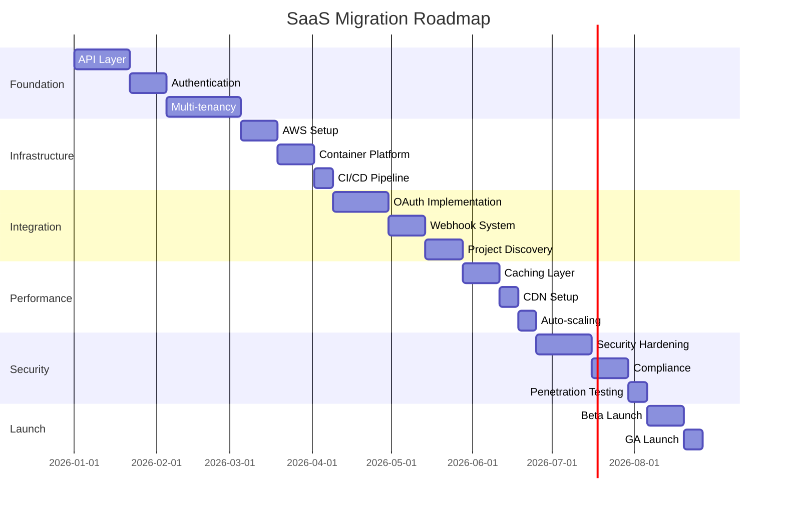

# SaaS Readiness Analysis

This document provides a comprehensive analysis of transforming the Monte Carlo forecasting tool into an enterprise-grade SaaS product, addressing architecture, security, integrations, performance, and deployment considerations.

## Table of Contents

1. [Current Architecture Strengths](#current-architecture-strengths)
2. [Third-Party Integrations](#third-party-integrations)
3. [Security Architecture](#security-architecture)
4. [Performance & Caching Infrastructure](#performance--caching-infrastructure)
5. [Deployment Architecture](#deployment-architecture)
6. [Multi-Tenancy & Project Discovery](#multi-tenancy--project-discovery)
7. [Vertical Slice Implementations](#vertical-slice-implementations)
8. [User Journey Implementations](#user-journey-implementations)
9. [Required Enhancements](#required-enhancements)
10. [Compliance & Governance](#compliance--governance)
11. [Monitoring & Operations](#monitoring--operations)
12. [Migration Path](#migration-path)

## Current Architecture Strengths

### ✅ Clean Architecture
- **Benefit**: Easy to add API layer without touching business logic
- **Implementation**: Just add REST/GraphQL controllers in presentation layer

### ✅ Repository Pattern
- **Benefit**: Swap storage backends without changing use cases
- **Current**: `InMemoryIssueRepository`
- **SaaS**: `PostgreSQLIssueRepository`, `DynamoDBIssueRepository`

### ✅ Dependency Injection
- **Benefit**: Configure different implementations per tenant
- **Example**: Different data sources, storage, limits per plan

### ✅ Stateless Use Cases
- **Benefit**: Horizontally scalable, cloud-native ready
- **Implementation**: Deploy on Kubernetes, AWS ECS, Lambda

### ✅ Domain-Driven Design
- **Benefit**: Clear boundaries for multi-tenancy
- **Implementation**: Add `TenantId` to aggregates

## Third-Party Integrations

### OAuth 2.0 Integration Architecture

Instead of storing API keys, implement OAuth 2.0 flows for secure third-party access:

```python
# OAuth integration layer
@dataclass
class OAuthConfig:
    provider: str  # 'jira', 'linear', 'github'
    client_id: str
    client_secret: str  # Stored in AWS Secrets Manager
    authorization_url: str
    token_url: str
    scopes: List[str]

class OAuthService:
    def __init__(self, secrets_manager: SecretsManager):
        self.secrets = secrets_manager
        self.configs = self._load_oauth_configs()
    
    def get_authorization_url(self, provider: str, tenant_id: str) -> str:
        """Generate OAuth authorization URL with state parameter"""
        config = self.configs[provider]
        state = self._generate_state(tenant_id)
        return f"{config.authorization_url}?client_id={config.client_id}&state={state}&scope={'+'.join(config.scopes)}"
    
    def exchange_code_for_token(self, provider: str, code: str, tenant_id: str) -> OAuthToken:
        """Exchange authorization code for access token"""
        # Implement OAuth code exchange
        pass
    
    def refresh_token(self, provider: str, refresh_token: str) -> OAuthToken:
        """Refresh expired access token"""
        # Implement token refresh
        pass

# Token storage with encryption
class SecureTokenRepository:
    def __init__(self, kms_client, dynamodb_client):
        self.kms = kms_client
        self.db = dynamodb_client
    
    def store_token(self, tenant_id: str, provider: str, token: OAuthToken):
        """Store encrypted OAuth tokens"""
        encrypted_token = self.kms.encrypt(
            KeyId='alias/oauth-tokens',
            Plaintext=json.dumps(token.to_dict())
        )
        
        self.db.put_item(
            TableName='oauth_tokens',
            Item={
                'tenant_id': tenant_id,
                'provider': provider,
                'encrypted_token': encrypted_token['CiphertextBlob'],
                'expires_at': token.expires_at,
                'created_at': datetime.utcnow().isoformat()
            }
        )
```

### Project Discovery

Implement automatic project discovery across integrated platforms:

```python
class ProjectDiscoveryService:
    def __init__(self, oauth_service: OAuthService):
        self.oauth = oauth_service
        self.providers = {
            'jira': JiraProjectDiscovery(),
            'linear': LinearProjectDiscovery(),
            'github': GitHubProjectDiscovery()
        }
    
    async def discover_projects(self, tenant_id: str) -> List[DiscoveredProject]:
        """Discover all accessible projects across integrated platforms"""
        projects = []
        
        # Get all active integrations for tenant
        integrations = await self._get_tenant_integrations(tenant_id)
        
        # Parallel discovery across providers
        tasks = []
        for integration in integrations:
            provider = self.providers[integration.provider]
            token = await self.oauth.get_valid_token(tenant_id, integration.provider)
            tasks.append(provider.discover_projects(token))
        
        results = await asyncio.gather(*tasks, return_exceptions=True)
        
        for result in results:
            if not isinstance(result, Exception):
                projects.extend(result)
        
        return projects

@dataclass
class DiscoveredProject:
    provider: str
    external_id: str
    name: str
    key: str
    description: Optional[str]
    permissions: List[str]  # User's permissions on this project
    metadata: Dict[str, Any]
```

### Webhook Integration

For real-time updates from integrated services:

```python
class WebhookService:
    def __init__(self, webhook_repository: WebhookRepository):
        self.repo = webhook_repository
    
    async def register_webhook(self, tenant_id: str, provider: str, events: List[str]):
        """Register webhooks with external services"""
        webhook_url = f"https://api.montecarlo-saas.com/webhooks/{tenant_id}/{provider}"
        
        if provider == 'jira':
            await self._register_jira_webhook(tenant_id, webhook_url, events)
        elif provider == 'linear':
            await self._register_linear_webhook(tenant_id, webhook_url, events)
    
    async def process_webhook(self, tenant_id: str, provider: str, payload: dict):
        """Process incoming webhook and update cache"""
        # Validate webhook signature
        if not self._validate_signature(provider, payload):
            raise InvalidWebhookSignature()
        
        # Process based on event type
        event_type = payload.get('webhookEvent')
        if event_type == 'issue_updated':
            await self._process_issue_update(tenant_id, payload)
```

## Security Architecture

### Enterprise Security Requirements

```python
# Security layers
class SecurityArchitecture:
    """Comprehensive security implementation"""
    
    def __init__(self):
        self.layers = {
            'network': NetworkSecurity(),
            'application': ApplicationSecurity(),
            'data': DataSecurity(),
            'identity': IdentityManagement(),
            'compliance': ComplianceEngine()
        }

# 1. Network Security
class NetworkSecurity:
    """AWS-native network security"""
    
    def configure_vpc(self):
        return {
            'vpc': {
                'cidr': '10.0.0.0/16',
                'enable_dns': True,
                'enable_flow_logs': True
            },
            'subnets': {
                'public': ['10.0.1.0/24', '10.0.2.0/24'],  # ALB
                'private': ['10.0.10.0/24', '10.0.11.0/24'],  # ECS/EKS
                'database': ['10.0.20.0/24', '10.0.21.0/24']  # RDS
            },
            'security_groups': {
                'alb': {'ingress': [{'port': 443, 'protocol': 'tcp', 'cidr': '0.0.0.0/0'}]},
                'app': {'ingress': [{'port': 8080, 'protocol': 'tcp', 'source': 'alb-sg'}]},
                'db': {'ingress': [{'port': 5432, 'protocol': 'tcp', 'source': 'app-sg'}]}
            }
        }

# 2. Application Security
class ApplicationSecurity:
    """Application-level security controls"""
    
    def __init__(self):
        self.rate_limiter = RateLimiter()
        self.csrf_protection = CSRFProtection()
        self.input_validator = InputValidator()
    
    async def secure_endpoint(self, request: Request):
        # Rate limiting
        if not await self.rate_limiter.check_rate(request.client.host):
            raise RateLimitExceeded()
        
        # CSRF validation
        if request.method in ['POST', 'PUT', 'DELETE']:
            if not self.csrf_protection.validate_token(request):
                raise CSRFValidationFailed()
        
        # Input validation
        sanitized_data = self.input_validator.sanitize(request.data)
        return sanitized_data

# 3. Data Security
class DataSecurity:
    """Encryption at rest and in transit"""
    
    def __init__(self, kms_client):
        self.kms = kms_client
        self.encryption_context = {'service': 'montecarlo-saas'}
    
    def encrypt_sensitive_data(self, data: dict, classification: str) -> bytes:
        """Encrypt data based on classification"""
        if classification == 'highly_sensitive':
            key_id = 'alias/montecarlo-highly-sensitive'
        else:
            key_id = 'alias/montecarlo-standard'
        
        response = self.kms.encrypt(
            KeyId=key_id,
            Plaintext=json.dumps(data),
            EncryptionContext=self.encryption_context
        )
        return response['CiphertextBlob']

# 4. Identity and Access Management
class IdentityManagement:
    """Multi-factor authentication and SSO"""
    
    def __init__(self):
        self.mfa_provider = MFAProvider()
        self.sso_providers = {
            'saml': SAMLProvider(),
            'oidc': OIDCProvider()
        }
    
    async def authenticate_user(self, credentials: dict, require_mfa: bool = True):
        # Primary authentication
        user = await self._verify_credentials(credentials)
        
        # MFA if required
        if require_mfa and user.mfa_enabled:
            mfa_token = credentials.get('mfa_token')
            if not await self.mfa_provider.verify_token(user.id, mfa_token):
                raise MFAVerificationFailed()
        
        # Generate session
        return await self._create_secure_session(user)

# 5. Audit Logging
class AuditLogger:
    """Comprehensive audit trail"""
    
    def __init__(self, cloudwatch_client):
        self.cloudwatch = cloudwatch_client
        self.log_group = '/aws/montecarlo/audit'
    
    async def log_action(self, action: AuditAction):
        """Log all security-relevant actions"""
        log_entry = {
            'timestamp': datetime.utcnow().isoformat(),
            'tenant_id': action.tenant_id,
            'user_id': action.user_id,
            'action': action.action_type,
            'resource': action.resource,
            'ip_address': action.ip_address,
            'user_agent': action.user_agent,
            'result': action.result,
            'metadata': action.metadata
        }
        
        await self.cloudwatch.put_log_events(
            logGroupName=self.log_group,
            logStreamName=f"{action.tenant_id}/{action.action_type}",
            logEvents=[{
                'timestamp': int(datetime.utcnow().timestamp() * 1000),
                'message': json.dumps(log_entry)
            }]
        )
```

### API Security

```python
# API Gateway security configuration
class APIGatewaySecurity:
    def __init__(self):
        self.jwt_validator = JWTValidator()
        self.api_key_manager = APIKeyManager()
    
    async def validate_request(self, request: Request) -> AuthContext:
        """Validate API requests"""
        # JWT validation for user requests
        if auth_header := request.headers.get('Authorization'):
            if auth_header.startswith('Bearer '):
                token = auth_header[7:]
                return await self.jwt_validator.validate(token)
        
        # API key validation for service-to-service
        if api_key := request.headers.get('X-API-Key'):
            return await self.api_key_manager.validate(api_key)
        
        raise UnauthorizedException("No valid authentication provided")
```

## Performance & Caching Infrastructure

### Multi-Layer Caching Strategy

```python
# Caching architecture
class CachingInfrastructure:
    """Multi-layer caching for optimal performance"""
    
    def __init__(self):
        self.layers = {
            'edge': CloudFrontCache(),          # CDN for static assets
            'api': APIGatewayCache(),           # API response caching
            'application': RedisCache(),        # Application-level cache
            'database': QueryResultCache()      # Database query caching
        }

# 1. Edge Caching with CloudFront
class CloudFrontCache:
    def configure(self):
        return {
            'distribution': {
                'origins': [{
                    'domain_name': 'api.montecarlo-saas.com',
                    'origin_path': '/api/v1',
                    'custom_headers': {
                        'X-Origin-Verify': '${SECRET_HEADER}'
                    }
                }],
                'cache_behaviors': [{
                    'path_pattern': '/api/v1/reports/*',
                    'cache_policy': {
                        'default_ttl': 3600,
                        'max_ttl': 86400,
                        'headers': ['Authorization', 'X-Tenant-ID']
                    }
                }]
            }
        }

# 2. Application Cache with Redis
class RedisCache:
    def __init__(self, redis_client):
        self.redis = redis_client
        self.default_ttl = 300  # 5 minutes
    
    async def get_or_compute(self, key: str, compute_fn, ttl: int = None):
        """Cache-aside pattern with automatic computation"""
        # Try cache first
        cached = await self.redis.get(key)
        if cached:
            return json.loads(cached)
        
        # Compute if not cached
        result = await compute_fn()
        
        # Store in cache
        await self.redis.setex(
            key,
            ttl or self.default_ttl,
            json.dumps(result)
        )
        
        return result
    
    async def invalidate_pattern(self, pattern: str):
        """Invalidate cache entries matching pattern"""
        cursor = 0
        while True:
            cursor, keys = await self.redis.scan(cursor, match=pattern)
            if keys:
                await self.redis.delete(*keys)
            if cursor == 0:
                break

# 3. Query Result Caching
class QueryResultCache:
    """Database query result caching"""
    
    def __init__(self, cache: RedisCache):
        self.cache = cache
    
    def cache_query(self, ttl: int = 300):
        """Decorator for caching query results"""
        def decorator(func):
            async def wrapper(*args, **kwargs):
                # Generate cache key from query parameters
                cache_key = self._generate_cache_key(func.__name__, args, kwargs)
                
                # Use cache-aside pattern
                return await self.cache.get_or_compute(
                    cache_key,
                    lambda: func(*args, **kwargs),
                    ttl
                )
            return wrapper
        return decorator

# 4. Intelligent Cache Warming
class CacheWarmer:
    """Proactive cache warming for frequently accessed data"""
    
    def __init__(self, scheduler, cache_service):
        self.scheduler = scheduler
        self.cache = cache_service
    
    def schedule_warming_jobs(self):
        # Warm popular project forecasts every hour
        self.scheduler.add_job(
            self._warm_popular_forecasts,
            'interval',
            hours=1,
            id='warm_popular_forecasts'
        )
        
        # Warm tenant dashboards at start of business day
        self.scheduler.add_job(
            self._warm_tenant_dashboards,
            'cron',
            hour=7,
            minute=0,
            timezone='UTC',
            id='warm_dashboards'
        )
    
    async def _warm_popular_forecasts(self):
        """Warm cache for frequently accessed forecasts"""
        popular_projects = await self._get_popular_projects()
        
        tasks = []
        for project in popular_projects:
            tasks.append(self._compute_and_cache_forecast(project))
        
        await asyncio.gather(*tasks, return_exceptions=True)
```

### Performance Optimization

```python
# Performance monitoring and optimization
class PerformanceOptimizer:
    def __init__(self):
        self.metrics = PerformanceMetrics()
        self.auto_scaler = AutoScaler()
    
    async def optimize_query(self, query: Query) -> OptimizedQuery:
        """Query optimization with execution plan analysis"""
        # Analyze query complexity
        complexity = self._analyze_complexity(query)
        
        if complexity.estimated_time > 5.0:  # 5 seconds
            # Use materialized view or pre-aggregated data
            return self._use_materialized_view(query)
        
        # Add appropriate indexes
        return self._add_query_hints(query)
    
    def configure_auto_scaling(self):
        """Auto-scaling configuration for ECS/EKS"""
        return {
            'metrics': [
                {
                    'name': 'CPUUtilization',
                    'target': 70,
                    'scale_up_threshold': 80,
                    'scale_down_threshold': 60
                },
                {
                    'name': 'RequestCountPerTarget',
                    'target': 1000,
                    'scale_up_threshold': 1200,
                    'scale_down_threshold': 800
                }
            ],
            'scaling_policy': {
                'min_capacity': 2,
                'max_capacity': 100,
                'cooldown_scale_up': 60,
                'cooldown_scale_down': 300
            }
        }
```

## Deployment Architecture

### AWS-Native Architecture with Container Flexibility

```yaml
# Infrastructure as Code - Terraform/CDK
infrastructure:
  compute:
    primary:
      type: "AWS ECS Fargate"
      reasons:
        - "Serverless containers - no cluster management"
        - "Automatic scaling"
        - "AWS-native integration"
    alternative:
      type: "AWS EKS"
      when: "Need Kubernetes-specific features or multi-cloud portability"
    
  api:
    gateway: "AWS API Gateway"
    load_balancer: "AWS ALB with WAF"
    
  data:
    primary_db: "Amazon RDS PostgreSQL Multi-AZ"
    cache: "Amazon ElastiCache Redis"
    object_storage: "Amazon S3"
    search: "Amazon OpenSearch"
    
  messaging:
    queue: "Amazon SQS"
    streaming: "Amazon Kinesis"
    pub_sub: "Amazon SNS"
    
  security:
    secrets: "AWS Secrets Manager"
    keys: "AWS KMS"
    certificates: "AWS Certificate Manager"
```

### Container Architecture

```dockerfile
# Multi-stage Dockerfile for optimal size and security
FROM python:3.11-slim as builder

# Install build dependencies
RUN apt-get update && apt-get install -y \
    build-essential \
    && rm -rf /var/lib/apt/lists/*

# Copy and install Python dependencies
COPY requirements.txt .
RUN pip install --user --no-cache-dir -r requirements.txt

# Production stage
FROM python:3.11-slim

# Security: Run as non-root user
RUN useradd -m -u 1000 appuser

# Copy only necessary files
COPY --from=builder /root/.local /home/appuser/.local
COPY --chown=appuser:appuser ./src /app/src
COPY --chown=appuser:appuser ./config /app/config

WORKDIR /app
USER appuser

# Health check
HEALTHCHECK --interval=30s --timeout=3s --start-period=40s --retries=3 \
    CMD python -c "import requests; requests.get('http://localhost:8080/health').raise_for_status()"

# Non-root port
EXPOSE 8080

CMD ["python", "-m", "uvicorn", "src.presentation.api.main:app", "--host", "0.0.0.0", "--port", "8080"]
```

### Kubernetes Manifests (for EKS option)

```yaml
# Deployment with security and resource limits
apiVersion: apps/v1
kind: Deployment
metadata:
  name: montecarlo-api
spec:
  replicas: 3
  selector:
    matchLabels:
      app: montecarlo-api
  template:
    metadata:
      labels:
        app: montecarlo-api
    spec:
      serviceAccountName: montecarlo-api
      securityContext:
        runAsNonRoot: true
        runAsUser: 1000
        fsGroup: 1000
      containers:
      - name: api
        image: montecarlo/api:latest
        ports:
        - containerPort: 8080
        resources:
          requests:
            memory: "512Mi"
            cpu: "500m"
          limits:
            memory: "1Gi"
            cpu: "1000m"
        env:
        - name: DATABASE_URL
          valueFrom:
            secretKeyRef:
              name: montecarlo-secrets
              key: database-url
        livenessProbe:
          httpGet:
            path: /health
            port: 8080
          initialDelaySeconds: 30
          periodSeconds: 10
        readinessProbe:
          httpGet:
            path: /ready
            port: 8080
          initialDelaySeconds: 5
          periodSeconds: 5
---
# Horizontal Pod Autoscaler
apiVersion: autoscaling/v2
kind: HorizontalPodAutoscaler
metadata:
  name: montecarlo-api-hpa
spec:
  scaleTargetRef:
    apiVersion: apps/v1
    kind: Deployment
    name: montecarlo-api
  minReplicas: 3
  maxReplicas: 100
  metrics:
  - type: Resource
    resource:
      name: cpu
      target:
        type: Utilization
        averageUtilization: 70
  - type: Resource
    resource:
      name: memory
      target:
        type: Utilization
        averageUtilization: 80
```

### Blue-Green Deployment Strategy

```python
# Zero-downtime deployment orchestration
class BlueGreenDeployment:
    def __init__(self, ecs_client, alb_client):
        self.ecs = ecs_client
        self.alb = alb_client
    
    async def deploy(self, new_version: str):
        """Execute blue-green deployment"""
        # 1. Deploy to green environment
        green_service = await self._create_green_service(new_version)
        
        # 2. Run health checks
        if not await self._health_check_green(green_service):
            await self._rollback_green(green_service)
            raise DeploymentHealthCheckFailed()
        
        # 3. Run smoke tests
        if not await self._smoke_test_green(green_service):
            await self._rollback_green(green_service)
            raise DeploymentSmokeTestFailed()
        
        # 4. Gradually shift traffic
        for percentage in [10, 25, 50, 75, 100]:
            await self._shift_traffic(percentage)
            await asyncio.sleep(300)  # 5 minutes between shifts
            
            metrics = await self._get_metrics()
            if metrics.error_rate > 0.01:  # 1% error threshold
                await self._rollback_traffic()
                raise DeploymentErrorRateExceeded()
        
        # 5. Cleanup blue environment
        await self._cleanup_blue_service()
```

## Multi-Tenancy & Project Discovery

### Advanced Multi-Tenant Architecture

```python
# Tenant isolation strategies
class TenantIsolation:
    """Multiple isolation levels based on plan"""
    
    def __init__(self):
        self.strategies = {
            'shared': SharedPoolIsolation(),      # Free/Starter plans
            'dedicated': DedicatedPoolIsolation(), # Professional plan
            'isolated': FullIsolation()           # Enterprise plan
        }

class SharedPoolIsolation:
    """Row-level security with shared resources"""
    
    def configure_database(self):
        return """
        -- Row Level Security Policy
        CREATE POLICY tenant_isolation ON issues
            FOR ALL
            USING (tenant_id = current_setting('app.current_tenant')::uuid);
        
        -- Automatic tenant filtering
        CREATE OR REPLACE FUNCTION set_tenant_id()
        RETURNS TRIGGER AS $$
        BEGIN
            NEW.tenant_id = current_setting('app.current_tenant')::uuid;
            RETURN NEW;
        END;
        $$ LANGUAGE plpgsql;
        """

class DedicatedPoolIsolation:
    """Dedicated compute resources with shared database"""
    
    def allocate_resources(self, tenant_id: str):
        return {
            'ecs_service': f'montecarlo-{tenant_id}',
            'cpu': 2048,  # 2 vCPU
            'memory': 4096,  # 4 GB
            'auto_scaling': {
                'min': 2,
                'max': 10
            }
        }

class FullIsolation:
    """Complete infrastructure isolation for enterprise"""
    
    def provision_infrastructure(self, tenant: Tenant):
        return {
            'vpc': self._create_tenant_vpc(tenant),
            'database': self._create_tenant_database(tenant),
            'compute': self._create_tenant_ecs_cluster(tenant),
            'kms_key': self._create_tenant_kms_key(tenant)
        }
```

### Intelligent Project Discovery

```python
class SmartProjectDiscovery:
    """ML-enhanced project discovery and recommendation"""
    
    def __init__(self):
        self.ml_model = ProjectRelevanceModel()
        self.analyzers = {
            'velocity': VelocityAnalyzer(),
            'health': HealthAnalyzer(),
            'similarity': SimilarityAnalyzer()
        }
    
    async def discover_and_analyze(self, tenant_id: str) -> ProjectDiscoveryResult:
        """Discover projects and provide insights"""
        # 1. Discover all accessible projects
        all_projects = await self._discover_all_projects(tenant_id)
        
        # 2. Analyze project characteristics
        analyzed_projects = []
        for project in all_projects:
            analysis = await self._analyze_project(project)
            analyzed_projects.append({
                'project': project,
                'analysis': analysis,
                'relevance_score': self.ml_model.score_relevance(project, analysis)
            })
        
        # 3. Group and categorize
        return ProjectDiscoveryResult(
            recommended=self._get_recommended_projects(analyzed_projects),
            by_health=self._group_by_health(analyzed_projects),
            by_velocity_stability=self._group_by_velocity(analyzed_projects),
            insights=self._generate_insights(analyzed_projects)
        )
    
    async def _analyze_project(self, project: DiscoveredProject):
        """Deep analysis of project characteristics"""
        # Fetch recent data
        issues = await self._fetch_recent_issues(project)
        
        return {
            'velocity_trend': self.analyzers['velocity'].analyze(issues),
            'health_score': self.analyzers['health'].calculate_score(issues),
            'team_size': self._estimate_team_size(issues),
            'complexity': self._assess_complexity(issues),
            'forecast_readiness': self._check_forecast_readiness(issues)
        }
```

## Vertical Slice Implementations

### Slice 1: OAuth & Data Import Implementation

Aligned with the roadmap's first vertical slice, this implementation enables secure data source connections.

```python
# OAuth Flow Implementation
class OAuthFlowController:
    """Handle OAuth authentication flow for data sources"""
    
    def __init__(self, oauth_service: OAuthService, project_service: ProjectService):
        self.oauth = oauth_service
        self.projects = project_service
    
    async def initiate_connection(self, request: ConnectionRequest) -> ConnectionResponse:
        """Step 1: Initiate OAuth connection"""
        # Generate state for CSRF protection
        state = self._generate_secure_state(request.tenant_id, request.user_id)
        
        # Get authorization URL
        auth_url = self.oauth.get_authorization_url(
            provider=request.provider,
            tenant_id=request.tenant_id,
            state=state
        )
        
        # Store state for validation
        await self._store_state(state, request)
        
        return ConnectionResponse(
            authorization_url=auth_url,
            state=state,
            expires_in=600  # 10 minutes
        )
    
    async def handle_callback(self, code: str, state: str) -> ProjectSelectionResponse:
        """Step 2: Handle OAuth callback and fetch projects"""
        # Validate state
        request = await self._validate_state(state)
        if not request:
            raise InvalidStateError()
        
        # Exchange code for token
        token = await self.oauth.exchange_code_for_token(
            provider=request.provider,
            code=code,
            tenant_id=request.tenant_id
        )
        
        # Discover available projects
        projects = await self.projects.discover_projects(
            tenant_id=request.tenant_id,
            provider=request.provider,
            token=token
        )
        
        return ProjectSelectionResponse(
            projects=projects,
            connection_id=token.connection_id
        )

# Async Data Import Pipeline
class DataImportPipeline:
    """Handle async data import with progress tracking"""
    
    def __init__(self, sqs_client, import_service: ImportService):
        self.sqs = sqs_client
        self.import_service = import_service
    
    async def start_import(self, import_request: ImportRequest) -> ImportJob:
        """Start async import job"""
        job = ImportJob(
            id=str(uuid.uuid4()),
            tenant_id=import_request.tenant_id,
            projects=import_request.selected_projects,
            status=ImportStatus.QUEUED,
            created_at=datetime.utcnow()
        )
        
        # Send to SQS for processing
        await self.sqs.send_message(
            QueueUrl=config.IMPORT_QUEUE_URL,
            MessageBody=json.dumps(job.to_dict())
        )
        
        # Store job for tracking
        await self._store_job(job)
        
        return job
    
    async def get_import_progress(self, job_id: str) -> ImportProgress:
        """Get real-time import progress"""
        job = await self._get_job(job_id)
        
        return ImportProgress(
            job_id=job.id,
            status=job.status,
            total_issues=job.total_issues,
            processed_issues=job.processed_issues,
            progress_percentage=job.progress_percentage,
            estimated_time_remaining=job.estimated_time_remaining,
            errors=job.errors
        )
```

### Slice 2: Basic Forecasting Implementation

Core Monte Carlo forecasting with real-time parameter adjustment.

```python
# Real-time Forecasting API
class ForecastingAPI:
    """REST API for Monte Carlo forecasting"""
    
    def __init__(self, forecast_service: ForecastService, cache: RedisCache):
        self.forecast = forecast_service
        self.cache = cache
    
    @app.post("/api/v1/projects/{project_id}/forecast")
    async def generate_forecast(
        self,
        project_id: str,
        params: ForecastParameters,
        user: User = Depends(get_current_user)
    ) -> ForecastResponse:
        """Generate forecast with caching"""
        # Check cache first
        cache_key = f"forecast:{user.tenant_id}:{project_id}:{params.hash()}"
        cached = await self.cache.get(cache_key)
        if cached:
            return ForecastResponse.from_cache(cached)
        
        # Generate forecast
        result = await self.forecast.calculate(
            tenant_id=user.tenant_id,
            project_id=project_id,
            confidence_levels=params.confidence_levels,
            remaining_work=params.remaining_work,
            variance_factor=params.variance_factor
        )
        
        # Cache result
        await self.cache.set(cache_key, result, ttl=300)
        
        return ForecastResponse.from_domain(result)

# WebSocket for Live Updates
class ForecastWebSocket:
    """Real-time forecast updates via WebSocket"""
    
    @app.websocket("/ws/forecast/{project_id}")
    async def forecast_updates(self, websocket: WebSocket, project_id: str):
        await websocket.accept()
        
        try:
            while True:
                # Receive parameter updates
                data = await websocket.receive_json()
                params = ForecastParameters(**data)
                
                # Calculate new forecast
                result = await self.forecast.calculate_lightweight(
                    project_id=project_id,
                    params=params
                )
                
                # Send update
                await websocket.send_json({
                    "type": "forecast_update",
                    "data": result.to_dict()
                })
                
        except WebSocketDisconnect:
            await self._cleanup_connection(websocket)

# Forecast Visualization Data
class ForecastVisualizationService:
    """Prepare data for Chart.js/D3 visualization"""
    
    def prepare_visualization_data(self, forecast: ForecastResult) -> VisualizationData:
        """Transform forecast data for frontend visualization"""
        return VisualizationData(
            completion_dates={
                str(level): self._format_date(date)
                for level, date in forecast.confidence_dates.items()
            },
            probability_distribution=self._prepare_distribution(
                forecast.simulation_results
            ),
            velocity_trend=self._prepare_velocity_trend(
                forecast.historical_velocities
            ),
            burndown_projection=self._prepare_burndown(
                forecast.remaining_work,
                forecast.projected_velocities
            )
        )
```

### Slice 3: Interactive Dashboard Implementation

Customizable dashboard with real-time widgets and drag-and-drop functionality.

```python
# Dashboard Configuration Service
class DashboardService:
    """Manage customizable dashboards"""
    
    def __init__(self, repository: DashboardRepository):
        self.repo = repository
    
    async def get_dashboard(self, user_id: str, dashboard_id: str = None) -> Dashboard:
        """Get user's dashboard configuration"""
        if dashboard_id:
            dashboard = await self.repo.get_by_id(dashboard_id)
        else:
            dashboard = await self.repo.get_default(user_id)
        
        if not dashboard:
            dashboard = await self._create_default_dashboard(user_id)
        
        return dashboard
    
    async def update_layout(self, dashboard_id: str, layout: DashboardLayout) -> Dashboard:
        """Update dashboard widget layout"""
        dashboard = await self.repo.get_by_id(dashboard_id)
        dashboard.layout = layout
        dashboard.updated_at = datetime.utcnow()
        
        await self.repo.save(dashboard)
        
        # Notify real-time subscribers
        await self._notify_layout_change(dashboard_id, layout)
        
        return dashboard

# Widget Framework
class WidgetFramework:
    """Extensible widget system for dashboards"""
    
    def __init__(self):
        self.widget_types = {
            'forecast_summary': ForecastSummaryWidget,
            'velocity_chart': VelocityChartWidget,
            'health_metrics': HealthMetricsWidget,
            'sprint_progress': SprintProgressWidget,
            'team_capacity': TeamCapacityWidget,
            'risk_matrix': RiskMatrixWidget,
            'burndown_chart': BurndownChartWidget,
            'portfolio_view': PortfolioViewWidget
        }
    
    async def render_widget(self, widget_config: WidgetConfig) -> WidgetData:
        """Render widget data based on configuration"""
        widget_class = self.widget_types.get(widget_config.type)
        if not widget_class:
            raise InvalidWidgetTypeError(widget_config.type)
        
        widget = widget_class(widget_config)
        data = await widget.fetch_data()
        
        return WidgetData(
            id=widget_config.id,
            type=widget_config.type,
            title=widget_config.title,
            data=data,
            refresh_interval=widget_config.refresh_interval,
            last_updated=datetime.utcnow()
        )

# Real-time Dashboard Updates
class DashboardRealtimeService:
    """Handle real-time dashboard updates via GraphQL subscriptions"""
    
    @strawberry.subscription
    async def dashboard_updates(self, dashboard_id: str) -> AsyncGenerator[DashboardUpdate, None]:
        """Subscribe to dashboard updates"""
        async for update in self._subscribe_to_updates(dashboard_id):
            yield DashboardUpdate(
                widget_id=update.widget_id,
                data=update.data,
                timestamp=update.timestamp
            )
```

### Slice 4: Team Health Metrics Implementation

Process health monitoring with intelligent alerting.

```python
# Health Metrics Calculator
class HealthMetricsService:
    """Calculate and track team health metrics"""
    
    def __init__(self, metrics_repo: MetricsRepository):
        self.repo = metrics_repo
    
    async def calculate_health_score(self, team_id: str) -> HealthScore:
        """Calculate comprehensive health score"""
        # Fetch component scores
        velocity_score = await self._calculate_velocity_stability(team_id)
        lead_time_score = await self._calculate_lead_time_score(team_id)
        wip_score = await self._calculate_wip_score(team_id)
        aging_score = await self._calculate_aging_score(team_id)
        defect_score = await self._calculate_defect_rate_score(team_id)
        
        # Calculate weighted overall score
        overall_score = (
            velocity_score * 0.25 +
            lead_time_score * 0.20 +
            wip_score * 0.20 +
            aging_score * 0.20 +
            defect_score * 0.15
        )
        
        return HealthScore(
            overall=overall_score,
            components={
                'velocity_stability': velocity_score,
                'lead_time': lead_time_score,
                'wip_limits': wip_score,
                'work_aging': aging_score,
                'defect_rate': defect_score
            },
            trend=await self._calculate_trend(team_id),
            recommendations=await self._generate_recommendations(overall_score)
        )

# Intelligent Alerting System
class AlertingService:
    """Smart alerting based on health thresholds"""
    
    def __init__(self, notification_service: NotificationService):
        self.notifications = notification_service
    
    async def check_health_thresholds(self, team_id: str, health_score: HealthScore):
        """Check if alerts should be triggered"""
        alerts = []
        
        # Check overall health
        if health_score.overall < 0.6:
            alerts.append(Alert(
                severity=AlertSeverity.HIGH,
                type=AlertType.HEALTH_CRITICAL,
                message=f"Team health critical: {health_score.overall:.1%}",
                recommendations=health_score.recommendations
            ))
        
        # Check component thresholds
        for component, score in health_score.components.items():
            threshold = self._get_threshold(component)
            if score < threshold:
                alerts.append(self._create_component_alert(component, score))
        
        # Send notifications
        for alert in alerts:
            await self.notifications.send_alert(team_id, alert)
```

### Slice 5: Multi-Project Portfolio Views

Portfolio management for delivery managers.

```python
# Portfolio Aggregation Service
class PortfolioService:
    """Aggregate metrics across multiple projects"""
    
    async def get_portfolio_view(self, portfolio_id: str) -> PortfolioView:
        """Get comprehensive portfolio metrics"""
        projects = await self._get_portfolio_projects(portfolio_id)
        
        # Parallel data fetching
        tasks = []
        for project in projects:
            tasks.extend([
                self._get_project_forecast(project.id),
                self._get_project_health(project.id),
                self._get_project_risks(project.id)
            ])
        
        results = await asyncio.gather(*tasks)
        
        return PortfolioView(
            summary=self._aggregate_summary(results),
            projects=self._prepare_project_views(projects, results),
            risks=self._aggregate_risks(results),
            timeline=self._create_timeline_view(results),
            resource_allocation=self._analyze_resources(projects)
        )

# Cross-Project Dependencies
class DependencyAnalyzer:
    """Analyze and visualize cross-project dependencies"""
    
    async def analyze_dependencies(self, portfolio_id: str) -> DependencyGraph:
        """Build dependency graph for portfolio"""
        projects = await self._get_projects(portfolio_id)
        dependencies = await self._fetch_dependencies(projects)
        
        graph = DependencyGraph()
        
        # Build graph
        for dep in dependencies:
            graph.add_edge(
                from_project=dep.from_project,
                to_project=dep.to_project,
                dependency_type=dep.type,
                impact=dep.impact
            )
        
        # Analyze critical path
        critical_path = graph.find_critical_path()
        bottlenecks = graph.identify_bottlenecks()
        
        return DependencyAnalysis(
            graph=graph,
            critical_path=critical_path,
            bottlenecks=bottlenecks,
            recommendations=self._generate_recommendations(graph)
        )
```

### Slice 6: Custom Reporting Implementation

Flexible reporting engine with export capabilities.

```python
# Report Template Engine
class ReportTemplateEngine:
    """Customizable report generation"""
    
    def __init__(self, template_repo: TemplateRepository):
        self.templates = template_repo
        self.renderers = {
            'pdf': PDFRenderer(),
            'excel': ExcelRenderer(),
            'powerpoint': PowerPointRenderer(),
            'markdown': MarkdownRenderer()
        }
    
    async def generate_report(self, report_request: ReportRequest) -> Report:
        """Generate custom report based on template"""
        # Load template
        template = await self.templates.get(report_request.template_id)
        
        # Gather data based on template requirements
        data = await self._gather_report_data(
            template.data_sources,
            report_request.parameters
        )
        
        # Apply filters and transformations
        processed_data = self._process_data(data, template.transformations)
        
        # Render report
        renderer = self.renderers[report_request.format]
        output = await renderer.render(template, processed_data)
        
        return Report(
            id=str(uuid.uuid4()),
            name=report_request.name,
            format=report_request.format,
            content=output,
            generated_at=datetime.utcnow()
        )

# Scheduled Report Service
class ScheduledReportService:
    """Handle scheduled report generation and distribution"""
    
    async def schedule_report(self, schedule: ReportSchedule) -> str:
        """Schedule recurring report"""
        job_id = await self.scheduler.add_job(
            func=self._generate_and_send_report,
            trigger=schedule.trigger,
            args=[schedule.report_config],
            id=f"report_{schedule.id}",
            name=schedule.name
        )
        
        await self._store_schedule(schedule, job_id)
        return job_id
```

### Slice 7: Admin & Billing Implementation

Enterprise-ready administration and billing system.

```python
# Billing Service with Stripe Integration
class BillingService:
    """Handle subscription billing and usage tracking"""
    
    def __init__(self, stripe_client, usage_tracker: UsageTracker):
        self.stripe = stripe_client
        self.usage = usage_tracker
    
    async def create_subscription(self, tenant: Tenant, plan: PricingPlan) -> Subscription:
        """Create new subscription"""
        # Create or get Stripe customer
        customer = await self._get_or_create_customer(tenant)
        
        # Create subscription
        stripe_sub = self.stripe.Subscription.create(
            customer=customer.id,
            items=[{
                'price': plan.stripe_price_id,
            }],
            metadata={
                'tenant_id': tenant.id,
                'plan': plan.name
            }
        )
        
        # Store subscription
        subscription = Subscription(
            id=stripe_sub.id,
            tenant_id=tenant.id,
            plan=plan,
            status=SubscriptionStatus.ACTIVE,
            current_period_start=datetime.fromtimestamp(stripe_sub.current_period_start),
            current_period_end=datetime.fromtimestamp(stripe_sub.current_period_end)
        )
        
        await self._store_subscription(subscription)
        return subscription

# Usage-Based Billing
class UsageTracker:
    """Track usage for metered billing"""
    
    async def track_api_call(self, tenant_id: str, endpoint: str):
        """Track API usage"""
        usage_key = f"usage:{tenant_id}:{datetime.utcnow().strftime('%Y-%m')}"
        await self.redis.hincrby(usage_key, endpoint, 1)
        
        # Check if limits exceeded
        usage = await self.get_current_usage(tenant_id)
        limits = await self._get_plan_limits(tenant_id)
        
        if usage.api_calls > limits.api_calls:
            raise UsageLimitExceeded("API call limit exceeded")

# Admin Dashboard
class AdminDashboardService:
    """Administrative dashboard for system management"""
    
    async def get_system_metrics(self) -> SystemMetrics:
        """Get comprehensive system metrics"""
        return SystemMetrics(
            tenants={
                'total': await self._count_tenants(),
                'active': await self._count_active_tenants(),
                'by_plan': await self._count_tenants_by_plan()
            },
            usage={
                'api_calls': await self._get_total_api_calls(),
                'storage': await self._get_storage_usage(),
                'compute': await self._get_compute_usage()
            },
            revenue={
                'mrr': await self._calculate_mrr(),
                'arr': await self._calculate_arr(),
                'growth_rate': await self._calculate_growth_rate()
            },
            health={
                'uptime': await self._get_uptime(),
                'error_rate': await self._get_error_rate(),
                'response_time': await self._get_avg_response_time()
            }
        )
```

## User Journey Implementations

### Onboarding Journey Implementation

```python
# Onboarding Flow Controller
class OnboardingController:
    """Handle first-time user onboarding"""
    
    async def start_onboarding(self, user: User) -> OnboardingSession:
        """Initialize onboarding session"""
        session = OnboardingSession(
            user_id=user.id,
            tenant_id=user.tenant_id,
            steps=[
                OnboardingStep('connect_data_source', status='pending'),
                OnboardingStep('configure_team', status='pending'),
                OnboardingStep('import_data', status='pending'),
                OnboardingStep('view_first_forecast', status='pending'),
                OnboardingStep('invite_team', status='pending')
            ],
            started_at=datetime.utcnow()
        )
        
        await self._store_session(session)
        return session
    
    async def complete_step(self, session_id: str, step_name: str) -> OnboardingProgress:
        """Mark onboarding step as complete"""
        session = await self._get_session(session_id)
        
        # Update step status
        for step in session.steps:
            if step.name == step_name:
                step.status = 'completed'
                step.completed_at = datetime.utcnow()
                break
        
        # Calculate progress
        completed = sum(1 for s in session.steps if s.status == 'completed')
        progress = OnboardingProgress(
            completed_steps=completed,
            total_steps=len(session.steps),
            percentage=completed / len(session.steps) * 100,
            next_step=self._get_next_step(session)
        )
        
        # Check if onboarding complete
        if progress.percentage == 100:
            await self._complete_onboarding(session)
        
        return progress

# Interactive Onboarding Guide
class OnboardingGuideService:
    """Provide contextual help during onboarding"""
    
    async def get_contextual_help(self, step: str, context: dict) -> OnboardingHelp:
        """Get help content for current step"""
        help_content = self.help_templates.get(step)
        
        # Personalize based on context
        if step == 'connect_data_source':
            help_content = self._customize_for_provider(
                help_content,
                context.get('provider')
            )
        
        return OnboardingHelp(
            title=help_content.title,
            description=help_content.description,
            video_url=help_content.video_url,
            tips=help_content.tips,
            common_issues=help_content.common_issues
        )
```

### Weekly Planning Journey Implementation

```python
# Sprint Planning Assistant
class SprintPlanningAssistant:
    """Guide teams through sprint planning"""
    
    async def prepare_planning_data(self, team_id: str) -> PlanningData:
        """Gather all data needed for sprint planning"""
        # Fetch historical data
        velocity_trend = await self._get_velocity_trend(team_id)
        capacity = await self._calculate_team_capacity(team_id)
        carry_over = await self._get_carry_over_work(team_id)
        risks = await self._identify_risks(team_id)
        
        # Generate recommendations
        recommended_commitment = self._calculate_recommended_commitment(
            velocity_trend,
            capacity,
            carry_over
        )
        
        return PlanningData(
            velocity_trend=velocity_trend,
            team_capacity=capacity,
            carry_over_work=carry_over,
            identified_risks=risks,
            recommended_commitment=recommended_commitment,
            confidence_level=self._calculate_confidence(velocity_trend)
        )

# Planning Collaboration Tools
class PlanningCollaborationService:
    """Real-time collaboration during planning"""
    
    @app.websocket("/ws/planning/{session_id}")
    async def planning_session(self, websocket: WebSocket, session_id: str):
        """Handle real-time planning collaboration"""
        await self.manager.connect(websocket, session_id)
        
        try:
            while True:
                data = await websocket.receive_json()
                
                if data['type'] == 'update_commitment':
                    await self._handle_commitment_update(session_id, data)
                elif data['type'] == 'add_risk':
                    await self._handle_risk_addition(session_id, data)
                elif data['type'] == 'adjust_capacity':
                    await self._handle_capacity_adjustment(session_id, data)
                
                # Broadcast updates to all participants
                await self.manager.broadcast(session_id, data)
                
        except WebSocketDisconnect:
            self.manager.disconnect(websocket, session_id)
```

### Executive Reporting Journey Implementation

```python
# Executive Dashboard Service
class ExecutiveDashboardService:
    """Specialized views for leadership"""
    
    async def generate_executive_summary(self, portfolio_id: str) -> ExecutiveSummary:
        """Generate high-level executive summary"""
        # Gather metrics
        delivery_metrics = await self._get_delivery_metrics(portfolio_id)
        financial_metrics = await self._get_financial_metrics(portfolio_id)
        risk_assessment = await self._get_risk_assessment(portfolio_id)
        
        # Generate insights
        insights = await self._generate_insights(
            delivery_metrics,
            financial_metrics,
            risk_assessment
        )
        
        return ExecutiveSummary(
            key_metrics={
                'on_time_delivery': delivery_metrics.on_time_percentage,
                'budget_utilization': financial_metrics.budget_utilization,
                'risk_score': risk_assessment.overall_score,
                'team_health': await self._get_avg_team_health(portfolio_id)
            },
            trends=self._analyze_trends(delivery_metrics),
            insights=insights,
            recommendations=self._generate_recommendations(insights),
            next_review_date=self._calculate_next_review()
        )

# Automated Insight Generation
class InsightGenerationService:
    """AI-powered insight generation for executives"""
    
    async def generate_insights(self, data: PortfolioData) -> List[Insight]:
        """Generate actionable insights from data"""
        insights = []
        
        # Delivery performance insights
        if data.on_time_delivery < 0.8:
            insights.append(Insight(
                type=InsightType.WARNING,
                category='delivery',
                title='Delivery Performance Below Target',
                description=f'Only {data.on_time_delivery:.0%} of projects delivering on time',
                impact='High',
                recommendation='Review estimation practices and identify bottlenecks'
            ))
        
        # Trend analysis
        velocity_trend = self._analyze_velocity_trend(data.velocity_history)
        if velocity_trend < -0.1:  # 10% decline
            insights.append(Insight(
                type=InsightType.ALERT,
                category='productivity',
                title='Declining Team Velocity',
                description='Team velocity has declined by {:.0%} over last 3 sprints'.format(abs(velocity_trend)),
                impact='Medium',
                recommendation='Investigate root causes: team changes, technical debt, or process issues'
            ))
        
        return insights
```

### Persona-Specific Implementations

#### Sarah the Scrum Master - Daily Workflow Tools

```python
# Sprint Health Dashboard
class ScrumMasterDashboard:
    """Specialized dashboard for Scrum Masters"""
    
    async def get_sprint_overview(self, team_id: str) -> SprintOverview:
        """Get current sprint health at a glance"""
        current_sprint = await self._get_current_sprint(team_id)
        
        return SprintOverview(
            sprint_number=current_sprint.number,
            progress={
                'completed_points': current_sprint.completed_points,
                'total_points': current_sprint.committed_points,
                'percentage': current_sprint.completion_percentage
            },
            velocity_status=await self._check_velocity_status(team_id),
            blockers=await self._get_current_blockers(team_id),
            at_risk_items=await self._identify_at_risk_items(team_id),
            daily_standup_insights=await self._generate_standup_topics(team_id)
        )

# Quick Actions for Common Tasks
class QuickActionsService:
    """Enable quick actions for repetitive tasks"""
    
    async def update_sprint_forecast(self, sprint_id: str, changes: SprintChanges):
        """Quick forecast update during sprint"""
        # Recalculate based on changes
        new_forecast = await self._recalculate_forecast(sprint_id, changes)
        
        # Auto-generate stakeholder message
        message = self._generate_update_message(changes, new_forecast)
        
        # Update and notify
        await self._update_forecast(sprint_id, new_forecast)
        await self._notify_stakeholders(sprint_id, message)
        
        return new_forecast
```

#### David the Delivery Manager - Portfolio Tools

```python
# Portfolio Risk Matrix
class PortfolioRiskAnalyzer:
    """Comprehensive risk analysis across portfolio"""
    
    async def generate_risk_matrix(self, portfolio_id: str) -> RiskMatrix:
        """Create risk matrix for all projects"""
        projects = await self._get_portfolio_projects(portfolio_id)
        
        risks = []
        for project in projects:
            project_risks = await self._analyze_project_risks(project)
            risks.extend(project_risks)
        
        return RiskMatrix(
            high_impact_high_probability=self._filter_risks(risks, 'high', 'high'),
            high_impact_low_probability=self._filter_risks(risks, 'high', 'low'),
            low_impact_high_probability=self._filter_risks(risks, 'low', 'high'),
            low_impact_low_probability=self._filter_risks(risks, 'low', 'low'),
            mitigation_strategies=self._generate_mitigation_plans(risks)
        )

# Resource Optimization Tools
class ResourceOptimizer:
    """Optimize resource allocation across teams"""
    
    async def suggest_reallocation(self, portfolio_id: str) -> ResourceSuggestions:
        """Suggest optimal resource allocation"""
        current_allocation = await self._get_current_allocation(portfolio_id)
        project_needs = await self._analyze_project_needs(portfolio_id)
        team_capacity = await self._calculate_available_capacity(portfolio_id)
        
        suggestions = self._optimize_allocation(
            current_allocation,
            project_needs,
            team_capacity
        )
        
        return ResourceSuggestions(
            moves=suggestions.recommended_moves,
            impact_analysis=suggestions.impact,
            risk_assessment=suggestions.risks,
            expected_improvement=suggestions.improvement_metrics
        )
```

#### Elena the Engineering Manager - Team Performance Tools

```python
# Team Performance Analytics
class TeamPerformanceAnalyzer:
    """Deep team performance insights"""
    
    async def analyze_team_performance(self, team_id: str) -> TeamPerformanceReport:
        """Comprehensive team performance analysis"""
        # Gather metrics
        velocity_analysis = await self._analyze_velocity_patterns(team_id)
        quality_metrics = await self._analyze_quality_trends(team_id)
        collaboration_health = await self._analyze_collaboration(team_id)
        skill_distribution = await self._analyze_skills(team_id)
        
        # Identify patterns
        bottlenecks = self._identify_bottlenecks(velocity_analysis)
        improvement_areas = self._identify_improvement_areas(quality_metrics)
        
        return TeamPerformanceReport(
            velocity_insights=velocity_analysis,
            quality_trends=quality_metrics,
            collaboration_score=collaboration_health,
            skill_gaps=skill_distribution.gaps,
            bottlenecks=bottlenecks,
            recommendations=self._generate_team_recommendations(
                velocity_analysis,
                quality_metrics,
                collaboration_health
            )
        )

# Capacity Planning Tools
class CapacityPlanningService:
    """Strategic capacity planning"""
    
    async def create_capacity_plan(self, team_id: str, horizon_months: int) -> CapacityPlan:
        """Create capacity plan for future sprints"""
        # Analyze historical capacity
        historical_capacity = await self._analyze_historical_capacity(team_id)
        
        # Factor in known changes
        planned_changes = await self._get_planned_changes(team_id)
        
        # Generate capacity forecast
        capacity_forecast = self._forecast_capacity(
            historical_capacity,
            planned_changes,
            horizon_months
        )
        
        return CapacityPlan(
            current_capacity=historical_capacity.current,
            forecasted_capacity=capacity_forecast,
            recommendations=self._generate_capacity_recommendations(capacity_forecast),
            scenarios=self._generate_what_if_scenarios(team_id, capacity_forecast)
        )
```

## Required Enhancements

### 1. Enterprise Authentication

```python
# SAML/OIDC SSO Integration
class EnterpriseAuth:
    def __init__(self):
        self.providers = {
            'saml': {
                'okta': OktaSAMLProvider(),
                'azure_ad': AzureADSAMLProvider(),
                'ping': PingIdentityProvider()
            },
            'oidc': {
                'google': GoogleOIDCProvider(),
                'azure_ad': AzureADOIDCProvider()
            }
        }
    
    async def configure_sso(self, tenant: Tenant, config: SSOConfig):
        """Configure SSO for enterprise tenant"""
        provider = self.providers[config.protocol][config.provider]
        
        # Store configuration
        await self._store_sso_config(tenant.id, config)
        
        # Configure provider
        metadata = await provider.configure(
            entity_id=f'https://montecarlo-saas.com/saml/{tenant.id}',
            acs_url=f'https://montecarlo-saas.com/saml/{tenant.id}/acs',
            certificate=config.certificate
        )
        
        return SSOConfigurationResult(
            login_url=metadata.login_url,
            metadata_url=f'https://montecarlo-saas.com/saml/{tenant.id}/metadata'
        )
```

### 2. Advanced API Gateway

```python
# GraphQL Federation for complex queries
class GraphQLAPI:
    def __init__(self):
        self.schema = self._build_federated_schema()
    
    def _build_federated_schema(self):
        return """
        type Query {
            # Single project forecast
            forecast(projectId: ID!, confidence: [Float!]): Forecast!
            
            # Multi-project portfolio view
            portfolio(projectIds: [ID!]!): PortfolioForecast!
            
            # Historical analysis
            velocityTrends(
                projectId: ID!
                timeRange: TimeRange!
                groupBy: GroupingPeriod!
            ): VelocityTrend!
            
            # Health metrics
            processHealth(projectId: ID!): ProcessHealthReport!
        }
        
        type Subscription {
            # Real-time forecast updates
            forecastUpdates(projectId: ID!): ForecastUpdate!
            
            # Health alerts
            healthAlerts(severity: AlertSeverity): HealthAlert!
        }
        
        type Mutation {
            # Update velocity adjustments
            updateVelocityAdjustments(
                projectId: ID!
                adjustments: [VelocityAdjustmentInput!]!
            ): VelocityAdjustmentResult!
            
            # Configure alerts
            configureAlerts(
                projectId: ID!
                rules: [AlertRuleInput!]!
            ): AlertConfiguration!
        }
        """
```

### 3. Event-Driven Architecture

```python
# Event sourcing for audit trail and replay
class EventStore:
    def __init__(self, dynamodb_client):
        self.db = dynamodb_client
        self.table_name = 'monte_carlo_events'
    
    async def append_event(self, event: DomainEvent):
        """Append event to event store"""
        await self.db.put_item(
            TableName=self.table_name,
            Item={
                'aggregate_id': event.aggregate_id,
                'version': event.version,
                'event_type': event.event_type,
                'event_data': json.dumps(event.data),
                'metadata': {
                    'tenant_id': event.tenant_id,
                    'user_id': event.user_id,
                    'timestamp': event.timestamp.isoformat(),
                    'correlation_id': event.correlation_id
                }
            },
            ConditionExpression='attribute_not_exists(aggregate_id) AND attribute_not_exists(version)'
        )
    
    async def get_events(self, aggregate_id: str, from_version: int = 0):
        """Retrieve events for aggregate"""
        response = await self.db.query(
            TableName=self.table_name,
            KeyConditionExpression='aggregate_id = :id AND version > :version',
            ExpressionAttributeValues={
                ':id': aggregate_id,
                ':version': from_version
            }
        )
        return [self._deserialize_event(item) for item in response['Items']]

# Event handlers for real-time processing
class EventHandlers:
    def __init__(self):
        self.handlers = {
            'VelocityUpdated': self._handle_velocity_update,
            'ForecastRequested': self._handle_forecast_request,
            'HealthThresholdBreached': self._handle_health_alert
        }
    
    async def _handle_velocity_update(self, event: VelocityUpdatedEvent):
        """Invalidate caches and trigger recalculation"""
        # Invalidate affected caches
        await self.cache.invalidate_pattern(f'forecast:{event.project_id}:*')
        
        # Trigger forecast recalculation
        await self.queue.send_message(
            'forecast-calculation',
            {
                'project_id': event.project_id,
                'trigger': 'velocity_update',
                'timestamp': event.timestamp
            }
        )
```

## Compliance & Governance

### Regulatory Compliance

```python
# Compliance framework
class ComplianceFramework:
    def __init__(self):
        self.frameworks = {
            'gdpr': GDPRCompliance(),
            'ccpa': CCPACompliance(),
            'soc2': SOC2Compliance(),
            'iso27001': ISO27001Compliance(),
            'hipaa': HIPAACompliance()  # If handling healthcare data
        }
    
    async def ensure_compliance(self, tenant: Tenant, data_operation: DataOperation):
        """Ensure operation complies with applicable regulations"""
        applicable_frameworks = self._get_applicable_frameworks(tenant)
        
        for framework_name in applicable_frameworks:
            framework = self.frameworks[framework_name]
            
            # Check compliance
            if not await framework.is_compliant(data_operation):
                raise ComplianceViolation(framework_name, data_operation)
            
            # Apply required controls
            await framework.apply_controls(data_operation)

# GDPR Implementation
class GDPRCompliance:
    async def handle_data_request(self, request_type: str, tenant_id: str, user_id: str):
        """Handle GDPR data requests"""
        if request_type == 'access':
            return await self._export_user_data(tenant_id, user_id)
        elif request_type == 'deletion':
            return await self._delete_user_data(tenant_id, user_id)
        elif request_type == 'portability':
            return await self._export_portable_data(tenant_id, user_id)
    
    async def _anonymize_data(self, tenant_id: str, user_id: str):
        """Anonymize user data while preserving analytics value"""
        # Replace PII with anonymized identifiers
        anonymous_id = hashlib.sha256(f"{tenant_id}:{user_id}".encode()).hexdigest()[:8]
        
        await self.db.execute("""
            UPDATE issues 
            SET assignee = $1, reporter = $1 
            WHERE tenant_id = $2 AND (assignee = $3 OR reporter = $3)
        """, f"anon_{anonymous_id}", tenant_id, user_id)
```

### Data Governance

```python
# Data classification and lifecycle management
class DataGovernance:
    def __init__(self):
        self.classifier = DataClassifier()
        self.lifecycle_manager = DataLifecycleManager()
    
    def classify_data(self, data: dict) -> DataClassification:
        """Classify data sensitivity"""
        classification = DataClassification()
        
        for field, value in data.items():
            if field in ['email', 'name', 'phone']:
                classification.add_field(field, 'PII', 'high')
            elif field in ['api_key', 'password', 'token']:
                classification.add_field(field, 'credential', 'critical')
            elif field in ['ip_address', 'user_agent']:
                classification.add_field(field, 'metadata', 'medium')
            else:
                classification.add_field(field, 'business', 'low')
        
        return classification
    
    async def apply_retention_policy(self, tenant: Tenant):
        """Apply data retention policies"""
        policies = self._get_retention_policies(tenant.plan)
        
        for policy in policies:
            if policy.action == 'delete':
                await self._delete_old_data(tenant.id, policy)
            elif policy.action == 'archive':
                await self._archive_old_data(tenant.id, policy)
            elif policy.action == 'anonymize':
                await self._anonymize_old_data(tenant.id, policy)
```

## Monitoring & Operations

### Comprehensive Observability

```python
# Monitoring stack configuration
class ObservabilityStack:
    def __init__(self):
        self.components = {
            'metrics': CloudWatchMetrics(),
            'traces': XRayTracing(),
            'logs': CloudWatchLogs(),
            'synthetics': CloudWatchSynthetics(),
            'rum': CloudWatchRUM()  # Real User Monitoring
        }
    
    def instrument_application(self, app):
        """Add comprehensive instrumentation"""
        # Metrics
        app.add_middleware(MetricsMiddleware(self.components['metrics']))
        
        # Tracing
        XRayMiddleware(app, self.components['traces'])
        
        # Custom business metrics
        self._setup_business_metrics(app)
    
    def _setup_business_metrics(self, app):
        """Track business-relevant metrics"""
        metrics = self.components['metrics']
        
        # Forecast accuracy
        metrics.create_metric('forecast_accuracy', unit='Percent')
        
        # API performance by endpoint
        metrics.create_metric('api_latency', unit='Milliseconds', dimensions=['endpoint', 'method'])
        
        # Tenant usage
        metrics.create_metric('active_tenants', unit='Count')
        metrics.create_metric('api_calls_per_tenant', unit='Count', dimensions=['tenant_id', 'plan'])

# Synthetic monitoring for critical user journeys
class SyntheticMonitoring:
    def __init__(self):
        self.synthetics = CloudWatchSynthetics()
    
    def create_canaries(self):
        """Create synthetic tests for critical paths"""
        canaries = [
            {
                'name': 'oauth-integration-flow',
                'script': self._oauth_flow_script(),
                'schedule': 'rate(5 minutes)'
            },
            {
                'name': 'forecast-generation',
                'script': self._forecast_generation_script(),
                'schedule': 'rate(10 minutes)'
            },
            {
                'name': 'api-health-check',
                'script': self._api_health_script(),
                'schedule': 'rate(1 minute)'
            }
        ]
        
        for canary in canaries:
            self.synthetics.create_canary(**canary)
```

### Operational Runbooks

```python
# Automated incident response
class IncidentResponse:
    def __init__(self):
        self.runbooks = {
            'high_error_rate': HighErrorRateRunbook(),
            'database_connection_failure': DatabaseFailureRunbook(),
            'integration_failure': IntegrationFailureRunbook(),
            'security_breach': SecurityBreachRunbook()
        }
    
    async def handle_alert(self, alert: Alert):
        """Execute appropriate runbook for alert"""
        runbook = self.runbooks.get(alert.type)
        
        if not runbook:
            await self._escalate_to_oncall(alert)
            return
        
        # Execute runbook
        result = await runbook.execute(alert)
        
        # Log execution
        await self._log_runbook_execution(alert, result)
        
        # Escalate if not resolved
        if not result.resolved:
            await self._escalate_to_oncall(alert, result)

class HighErrorRateRunbook:
    async def execute(self, alert: Alert) -> RunbookResult:
        """Automated response to high error rate"""
        steps = []
        
        # 1. Identify affected services
        affected_services = await self._identify_affected_services(alert)
        steps.append(f"Identified affected services: {affected_services}")
        
        # 2. Check recent deployments
        recent_deployments = await self._get_recent_deployments(affected_services)
        if recent_deployments:
            # Attempt automatic rollback
            rollback_result = await self._rollback_deployment(recent_deployments[0])
            steps.append(f"Rolled back deployment: {rollback_result}")
            
            # Wait and recheck
            await asyncio.sleep(60)
            if await self._check_error_rate() < alert.threshold:
                return RunbookResult(resolved=True, steps=steps)
        
        # 3. Scale up resources
        scale_result = await self._scale_up_services(affected_services)
        steps.append(f"Scaled up services: {scale_result}")
        
        # 4. Enable circuit breakers
        circuit_result = await self._enable_circuit_breakers(affected_services)
        steps.append(f"Enabled circuit breakers: {circuit_result}")
        
        return RunbookResult(
            resolved=False,
            steps=steps,
            recommendation="Manual intervention required"
        )
```

## Migration Path

### Detailed Migration Timeline



### Migration Phases

#### Phase 1: Foundation (Weeks 1-8)
- Implement REST/GraphQL API layer
- Add JWT-based authentication
- Implement basic multi-tenancy
- Set up development environment

#### Phase 2: Infrastructure (Weeks 9-12)
- Configure AWS infrastructure
- Set up ECS/EKS platform
- Implement CI/CD pipeline
- Configure monitoring

#### Phase 3: Integration (Weeks 13-18)
- Implement OAuth for Jira/Linear
- Build webhook system
- Create project discovery
- Add real-time updates

#### Phase 4: Performance (Weeks 19-22)
- Implement multi-layer caching
- Configure CDN
- Set up auto-scaling
- Optimize database queries

#### Phase 5: Security & Compliance (Weeks 23-27)
- Harden security
- Implement compliance frameworks
- Conduct penetration testing
- Obtain certifications

#### Phase 6: Launch (Weeks 28-30)
- Beta testing with select customers
- Performance tuning
- Documentation completion
- GA launch

## Summary

**Enhanced Readiness Score: 9/10**

The Monte Carlo tool is exceptionally well-positioned for enterprise SaaS transformation with these comprehensive enhancements:

### ✅ Strengths
- Clean architecture enables smooth transformation
- Repository pattern supports multiple storage backends
- Stateless design perfect for cloud-native deployment
- Domain boundaries support multi-tenancy

### ✅ Added Capabilities
- **OAuth Integration**: Secure third-party access without storing credentials
- **Enterprise Security**: Multi-layer security with compliance frameworks
- **Performance Infrastructure**: Comprehensive caching and optimization
- **AWS-Native Deployment**: Leveraging managed services with container flexibility
- **Project Discovery**: Intelligent project analysis and recommendations
- **Operational Excellence**: Monitoring, alerting, and automated response

### 🚀 Key Differentiators
- **No API Keys**: OAuth-based integration for enterprise security
- **Intelligent Discovery**: ML-enhanced project recommendations
- **Multi-Layer Caching**: Sub-second response times at scale
- **Compliance Ready**: GDPR, SOC2, ISO 27001 frameworks
- **Cloud Agnostic**: Container-based architecture enables multi-cloud

**Estimated Effort**: 28-30 weeks for production-ready enterprise SaaS with a team of 4-6 engineers.

**ROI Projection**: With proper execution, this architecture can support 10,000+ enterprise customers with 99.95% availability.